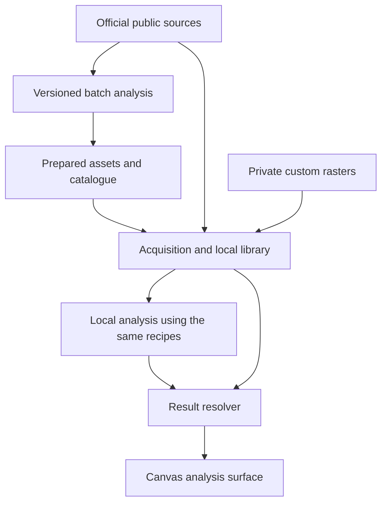

# From terrain data to useful agroecological design

2026-09-14 · Study `canopi-a7iu` · **Strategy proposals for review; no implementation or hosting deployment.**

Companion to the [scientific assessment](report.md) and [accepted LiDAR library plan](../lidar-library.md). This report reconsiders the delivery strategy. It does not silently replace accepted import, overlap, persistence or display requirements. Assume a small team, a Desktop-first delivery and limited appetite for operating a national geospatial service; no hosting budget has been supplied.

## 1. The outcome to optimize

**A user locates a project and obtains understandable, credible terrain information without becoming a GIS operator.** It remains available for field work and other Designs. A user with better survey data can refine the analysis without losing control of existing data.

Success is not measured by how much LiDAR Canopi hosts. It is measured by useful decisions supported: where water might arrive, where terrain concentrates it, which structures already occupy the site, where light is obstructed, and what needs field verification.

Separate four responsibilities:

1. Discover and acquire suitable observations.
2. Produce consistent, validated scientific results over the correct domain.
3. Distribute only the assets needed for viewing, offline use or recomputation.
4. Explain those results alongside the user's Design.

The publisher, computation engine and viewer need not run in the same place. **Compute coverage, download coverage and visible coverage are different.** A flow result can be calculated over a catchment and only its site-facing subset downloaded for display. Recomputing it after a terrain change may require the larger domain again.

## 2. Recommendation

Adopt **prepared regional results + direct official-source acquisition + local custom analysis**, in stages.

- Use IGN as the primary distributor of its public source data. Canopi should not initially mirror the national archive.
- Produce a small, independently validated set of regional analysis packages. Distribute these separately from application releases.
- Make prepared results the easiest route for ordinary users where available. Resolve/download suitable official terrain when a requested result is absent and supported local computation is feasible.
- Use one versioned analysis implementation for prepared public products and custom local calculations. Importing a custom file should not require uploading it to Canopi servers.
- Expand prepared coverage according to demonstrated demand and validation capacity. National coverage is a possible later outcome, not the prerequisite for a useful release.

This hybrid has more seams than a pure viewer. Its justification is that it addresses both easy use and custom data. Keep the seams narrow and build one useful route through them before adding a live compute service.

## 3. Compare the alternatives fairly

| Strategy | Strength | What it does not solve | Verdict |
| --- | --- | --- | --- |
| Mirror all IGN data on GitHub | Public, familiar, potentially convenient complete-file downloads | Scientific conditioning, freshness, spatial lookup, archive maintenance and user transfer cost | Poor primary strategy; useful for small demonstration packages and code |
| Download official data and compute everything locally | Low Canopi hosting cost; private custom data; offline after preparation | Large downloads, installation/engine burden, laptop performance and repeated work across users | Essential capability, weaker default for expensive regional analysis |
| Precompute all France and serve results | Fast viewing; shared methods and reusable computation | Upfront validation/processing, ongoing updates, arbitrary custom surveys and scenario parameters | Attractive later; premature national commitment now |
| Run every request on a Canopi server | Thin clients and consistent engine deployment | Queues, recurring cost, abuse controls, privacy, availability and offline recomputation | Defer until usage proves a need |
| Curated prepared regions with official-download/local fallback | Useful results early; limited infrastructure; supports advanced use | Requires consistent result contracts and clear coverage/readiness behavior | **Recommended** |
| Embed only existing third-party analysis services | Lowest initial scientific maintenance | Coverage, method transparency, offline rights and control may be insufficient | Reuse suitable references, but do not assume a complete agroecological service exists |

These are engineering assessments, not measured rankings. If the project cannot maintain a public dataset at all, the best reduced strategy is automatic official downloads plus local analysis—not an unmaintained hosted atlas. If thin Web clients become the dominant goal, prepared results gain priority, with heavy custom processing remaining Desktop or explicitly remote.

## 4. GitHub: possible does not mean the best fit

GitHub currently documents up to 1,000 assets per release, each under 2 GiB, with no total release-size or bandwidth limit. Therefore, “GitHub cannot store large datasets” would be an inaccurate objection. [GitHub Releases limits](https://docs.github.com/en/repositories/releasing-projects-on-github/about-releases).

However, that does not establish a suitable long-term national raster service. We would still need a geographic catalogue, immutable dataset versions, retries, updates, integrity checks and tested access from native/browser clients. Release assets do not themselves provide these. Validate redirects, range requests and client compatibility rather than assuming tile-serving behavior.

**Recommended role for GitHub:** application/pipeline source, recipes, small manifests, validation fixtures and limited downloadable examples. Keep large rasters out of the source repository. Small pilot packages can use Releases if the delivery path is verified. For a growing public atlas, prefer replaceable object storage or a partner's geospatial infrastructure; budget explicitly rather than relying on an unspecified platform commitment to bulk hosting.

“All LiDAR” also needs a definition. LAS/LAZ point clouds are different from the MNT/MNS/MNH rasters. IGN describes a program generating roughly three petabytes; that figure is not a verified size of today's public downloadable archive. Most proposed first-stage terrain analyses need raster elevations, not every classified point. [IGN program description](https://www.ign.fr/institut/programme-lidar-hd-vers-une-nouvelle-cartographie-3d-du-territoire).

Redistribution is not the principal obstacle: the MNT catalogue identifies Licence Ouverte 2.0. Preserve the actual source licence, attribution and update date in packages and visible attribution; identify Canopi's transformations separately. Check each additional source's terms rather than extending IGN's licence to it. [Official MNT catalogue](https://www.data.gouv.fr/datasets/mnt-lidar-hd), [Licence Ouverte 2.0](https://www.etalab.gouv.fr/wp-content/uploads/2017/04/ETALAB-Licence-Ouverte-v2.0.pdf).

## 5. Scale: choose the right product before choosing a host

The supplied raster uses four-byte Float32 cells. The following are arithmetic estimates of dense numeric payloads, **not measured compressed downloads or actual IGN archive totals**:

`bytes = area_km² × 1,000,000 ÷ resolution_m² × 4 × band_count`

| Coverage | One 0.5 m band | Three 0.5 m bands | Six 5 m result bands |
| --- | --- | --- | --- |
| 1 km² | 16 MB | 48 MB | 0.96 MB |
| 25 km² | 400 MB | 1.2 GB | 24 MB |
| 100 km² | 1.6 GB | 4.8 GB | 96 MB |
| Illustrative 550,000 km² domain | 8.8 TB | 26.4 TB | 528 GB |

Decimal units. The illustrative national-scale domain is an assumption, not a statement of current published coverage. These columns represent different products; six 5 m outputs cannot replace high-resolution source data for every analysis. Compression may reduce storage; overviews, masks, vectors, temporary files, retained versions and backups add to it. The earlier sample establishes MNH redundancy only for the matching trio, not for every survey combination.

At 20 Mbit/s, transferring 1.6 GB takes about 10.7 minutes even before overhead. Downloading the full upstream MNT merely to display a prepared flow map is avoidable. Conversely, promising instant custom hydrology from a tiny site crop is not credible.

Storage itself need not be prohibitive. As one current example, R2 Standard lists $0.015/GB-month, read/write request charges and no Internet egress charge. At that storage-only rate, the illustrative 26.4 TB is about $396/month; 528 GB is about $7.92/month, before free allowances and other costs. These are arithmetic examples, not a vendor selection or project budget. Processing, validation, support, multiple generations and serving infrastructure remain unpriced. [R2 pricing](https://developers.cloudflare.com/r2/pricing/).

The decisive question is which validated products and resolutions support users—not how to make a national copy free. Benchmark a pilot's CPU-hours/km², peak RAM, temporary disk, output bytes/km², request amplification and update cost before extrapolating national processing. An initial build also differs from a small data refresh; an algorithm revision can require rebuilding every published region.

## 6. What a prepared package should contain

Think of a **downloadable set of site evidence**, not a single rendered screenshot or a compulsory giant ZIP. A manifest identifies immutable components so different Designs and overlapping site downloads reuse bytes.

| Component | Purpose |
| --- | --- |
| Display tiles and legends | Fast first view at supported zoom levels |
| Numeric result rasters / typed vectors | Honest values, summaries and reuse beyond one color scheme |
| Validity and quality masks | Distinguish unknown, incomplete upstream context, interpolated or conditioned areas |
| Provenance manifest | Source identities/dates, accepted masks, CRS/grid, recipe and engine versions, analysis domain, parameters, validation status and licence |
| Optional numerical inputs | Download only when local refinement/recomputation needs them |

Use numeric COGs for block-addressable rasters. COG combines tiling, overviews and HTTP range access; it is a format capability, not proof that a particular provider supports the required delivery path. MapLibre also needs a suitable display adapter—it does not make arbitrary analytical TIFFs into map layers by itself. [OGC COG standard](https://www.ogc.org/standards/ogc-cloud-optimized-geotiff/).

Begin with static, geographically partitioned catalogue files using STAC where appropriate; avoid making every app download a national JSON inventory. A dynamic catalogue server is unnecessary until query/load requirements justify it. [STAC specification](https://stacspec.org/en/about/stac-spec/).

For prepared raster/vector map tiles, PMTiles is a candidate for range-readable archives, alongside ordinary tile delivery. Select one path in the pilot; do not implement several equivalent formats initially. Preserve numeric authority separately from rendered colors. [PMTiles concepts](https://docs.protomaps.com/pmtiles/).

A downloaded viewing package can work offline without all source inputs. Mark whether it supports viewing only or also local recomputation. Basemap availability is separate: promise offline analysis assets only, unless basemap offline delivery is separately implemented and licensed. Keep data packages out of the app installer and version them independently of software releases.

## 7. Which computation belongs where?

| Output | Suggested execution | Why |
| --- | --- | --- |
| Elevation appearance, height thresholds, slope/aspect | Prepared defaults plus local calculation | Reusable; local windows/neighborhoods are manageable |
| Regional flow accumulation, drainage connectivity, wetness indicators | Precompute validated coherent domains; local recomputation for supported custom cases | Nonlocal upstream dependencies; shared work benefits many users |
| Per-Design summaries over existing results | Local | Depends on private geometry, generally inexpensive |
| Date-specific shade | Cache reusable terrain/obstruction information; calculate requested dates when practical | Precomputing every time, season and scenario is wasteful |
| Rainfall, infiltration and intervention scenarios | Explicit jobs later | Parameter- and observation-dependent; no universal precomputed answer |
| Raw point-cloud classification | Specialist/batch processing when a specific feature needs it | Unnecessary for the initial terrain and height workflow |

Prepared analysis should use a **validated effective terrain mosaic**, not simply the newest file at each pixel. Complete geographic coverage can still contain mismatched dates, datums, seams, interpolation errors, missing culverts and real depressions. A national download solves none of these automatically.

Precomputation also does not turn topographic wetness potential into measured soil moisture. Retain the scientific distinctions in the earlier report. SoilGrids and other soil evidence remain optional context; climate, drainage and observations are still needed for stronger water-state claims. The first public offering should prioritize terrain, height structure and validated potential water pathways rather than a national agroecological suitability score.

Compute hydrology on coherent domains before cutting results into delivery tiles. Regions used for scheduling or storage do not define water boundaries. Route across them correctly; respect genuine sinks and mark uncertain dependencies. Even national coverage may omit upstream terrain across a border. Source overviews and cartographic mosaics are not automatically hydrological analysis grids. [GRASS domain and routing guidance](https://grass.osgeo.org/grass-stable/manuals/r.watershed.html).

A later multiscale model could couple regional routing with fine local terrain, but transferring coarse accumulation into fine grids is not a shortcut with guaranteed correctness. It needs explicit boundary fluxes, consistent catchment accounting and validation after local edits. Initially, recompute the supported domain or return an incomplete result when necessary inputs are unavailable.

## 8. One ordinary workflow, one advanced extension

**Ordinary workflow:** locate a Design → choose Terrain, Height or Water pathways → discover usable coverage automatically → show prepared results or an explicit preparation/download action with estimated size → retain selected assets locally. Do not expose file names or processing partitions as the primary interaction. Library remains available for storage and provenance management.

When no prepared result exists, the app can offer a supported local calculation using official inputs. If neither adequate inputs nor a supported engine are available, say so inside the requested analysis. Do not silently substitute a differently defined product. No accounts or Design uploads are required for reading public prepared assets, although hosts can observe requested regions.

**Advanced workflow:** import custom GeoTIFF → confirm meaning, units/reference and useful capabilities → review overlapping areas Before/After → keep existing or approve replacements, with independent non-overlapping additions → recompute affected analyses. A custom elevation raster may extend MNT; an unknown numeric band cannot be treated as elevation merely because it is a TIFF.

Imported custom terrain must not silently upload to a public processing job or overwrite a hosted baseline. Keep the baseline and private accepted overrides identifiable, with one deterministic effective surface per type. A later remote-compute option needs explicit transmission and retention controls. Publicly sharing a result does not automatically authorize sharing its private source data.

**Critical edge case:** an approved terrain change affects more than its footprint. Nearby slope and possibly downstream flow results become stale. Recompute the relevant dependency domain and publish atomically; do not paste a newly calculated local flow patch into an old regional result. If full recomputation is unavailable, retain a clearly identified baseline result or withhold affected results—never present the combination as a current custom analysis.

All views preserve the agreed stack:

`basemap → terrain / height / analysis backgrounds → grid + all Design objects and interaction overlays`

No Fit control, auto-recenter or resurrected point-inspection feature is proposed.

## 9. Updates without losing the accepted user controls

Automatic discovery, download and replacement are separate actions. New coverage should appear without a manual catalogue refresh. Bounded display reads follow the visible area; large offline/input downloads have an explicit scope and size. Cached assets are reusable across Designs.

The accepted overwrite rule also applies to official-source replacements: discovery of a newer public dataset must not silently override previously accepted effective data or private imports. Present one geographic Before/After batch review, not a prompt for every tile. Existing data can be retained while uncovered additions are accepted. Once accepted, all Designs following that type update automatically.

A publisher can issue a new analysis algorithm on unchanged observations. Treat that as a result-method revision, distinct from source replacement. **Proposed policy:** automatically adopt validated compatible bug-fix rebuilds with recorded provenance; material changes in method/meaning receive an analysis-level review. This needs an explicit product decision. Changing PNG encoding alone is a cache change, not a new survey or scientific result.

Adjacent prepared regions must use compatible measurement definitions, methods, resolutions and display scales to form one continuous product. A resolver must not silently mosaic TWI with a different wetness index, or disguise region-relative percentiles as comparable values. Show incomplete coverage when compatible results are absent; fetching more colored tiles cannot resolve a scientific incompatibility.

Passive missing/unreadable LiDAR continues to fail silently while other app content works. Explicit download or analysis commands return a local success, incomplete or failure outcome. Published quality metadata is part of interpreting a result, not a global reopening/change notice.

## 10. Architecture that keeps future choices open

Keep the analysis pipeline independent of the Tauri UI, with a headless entry point and pinned engine/recipes. Batch publication and Desktop execution use that implementation; numerical equivalence tests catch differences in packaging, engine versions and platform behavior. This is a shared calculation contract, not an assumption of bit-identical floating-point output across platforms.

The local SQLite catalogue remains appropriate for source/result identity, spatial lookup, accepted overrides and job state. Numeric pixels stay in raster assets. Add acquisition/provider adapters and an analysis result resolver; avoid coupling the database to GitHub release IDs or one bucket hostname. Preserve immutable hashes, generation snapshots, exact masks and atomic publication from the prior plan.

Public publishing needs a small, real operational pipeline: discover changes, acquire bounded sources, validate, process, check quality, upload immutable artifacts, then advance a catalogue pointer. Keep previous valid output available for rollback. Verify trusted manifests and asset integrity, bound parser/resource use, and measure failures. Checksums establish byte integrity, not scientific validity; publication still requires quality review.

Begin with a batch publisher and static hosting. A request queue, user accounts, autoscaling workers and billing are additional systems, not implied by using object storage. Protect Desktop interactive work through the existing Native Operation Executor and lifecycle ownership rules. A future Web viewer could reuse prepared assets, but current Web map scope does not authorize LiDAR rendering, location editing or offline caching; these require separate decisions.

## 11. Outside-the-box opportunities worth considering

| Idea | Why it could improve the outcome | Boundary |
| --- | --- | --- |
| **Share computation, not the entire source archive** | One validated catchment analysis serves many nearby Designs | Reuse only compatible recipes/inputs; custom data remain private |
| **Open regional evidence packages** | Advisers, associations and partners can build or distribute useful areas, including by removable storage | Third-party packages need provenance, integrity and validation; do not blindly trust community outputs |
| **Acquire context according to the question** | Shade needs relevant obstructions; water needs upstream terrain; height display needs only visible coverage | One fixed download radius is not sufficient for every analysis |
| **Reuse established environmental references** | Known watercourses/basins help investigate routing instead of recreating every environmental layer from LiDAR | BD TOPAGE is a reference network, not complete microdrainage or calibrated field flow |
| **Observation-led refinement** | Culvert checks and wet-season observations can improve decisions more than more indices | Keep observations and corrections dated and separate from original terrain |
| **Partner before building a national service** | A geospatial/research partner may offer expertise, hosting or validation Canopi lacks | Explore only; no contact or commitment made in this study |

BD TOPAGE provides a shared description of the hydrographic network and catchments. Its role here is contextual evidence and cross-checking, not automatic authority to force all modeled runoff into mapped lines. [Sandre reference description](https://www.sandre.eaufrance.fr/v2/news/publication-de-trois-nouveaux-documents-pour-mieux-comprendre-et-utiliser-la-bd-topage).

## 12. Delivery sequence and review decisions

First prove a complete vertical slice on the supplied area plus the additional domain required for a defensible selected analysis. Use a prepared result, an in-app download and persistent display, and a small custom replacement that triggers a local recalculation. Add contrasting terrain cases before claiming general reliability. This is a proposed change of emphasis from building the entire general-purpose library before proving scientific delivery; accepted import capabilities remain part of the target.

Next validate the scientific engine, package/manifest contracts, missing coverage, seams, update/rollback behavior, interrupted downloads, offline reopening and memory limits. Measure time to first useful view and cost of generating/updating a region. Then publish a limited regional offering and expand only when accuracy, coverage demand and maintenance economics support it. Precomputing France or deploying a live cloud compute API is not the first milestone.

| ID | Proposed decision | Recommendation |
| --- | --- | --- |
| S1 | Deliver decision-oriented site information; file management is secondary | Adopt |
| S2 | Mirror the complete IGN point/raster archive on GitHub | Reject as initial/core infrastructure |
| S3 | Prepared regional results, with official-source and local-compute fallback | Adopt in stages |
| S4 | One engine/recipe contract for public and custom analysis | Adopt |
| S5 | Stream bounded views; offer persistent offline evidence packages separately from app releases | Adopt for Desktop |
| S6 | Preserve private imports, explicit overlaps and automatic coverage after acceptance | Essential |
| S7 | Publish all France before delivering the feature | Defer; validate regions and operating model first |
| S8 | Deploy per-user cloud processing | Defer until demand justifies operations/privacy costs |
| S9 | Open package/pipeline format enabling partners to produce regions | Keep the format open; defer a marketplace/contribution platform |
| S10 | Automatically adopt compatible analysis fixes; review material method changes | Review this new update policy |

The recommendation's main weakness is maintaining both published data and a local engine. The mitigation is one scientific implementation, one result contract, limited initial products and no live processing backend. If that is still too much operational work, choose the official-download/local-only strategy explicitly instead of promising national prepared coverage.

## Evidence and limits of this study

Reviewed primary GitHub, IGN/Géoplateforme, ISRIC-linked prior research, OGC/STAC/PMTiles, Sandre and storage-provider documentation; checked the repository's map boundaries and prior measured raster evidence. Recomputed the storage/transfer examples from the formula above. The official data.gouv API returned the MNT product licence and WMS/WMTS/WFS references. A bounded native request to the Géoplateforme download discovery endpoint returned HTTP 403 in this environment; therefore direct acquisition was **not** verified end to end. That result does not establish a general provider outage.

Géoplateforme documents discovery/download endpoints, geographic filtering, pagination and a 10-requests/second per-IP limit. Implement an adapter with bounded concurrency, resumable transfers, timeouts and retry/backoff, and validate actual MNT/MNS/MNH asset discovery before committing to a delivery path. Do not assume every published product is immediately available everywhere or every endpoint supports numeric streaming. [Official download API](https://ignf.github.io/cartes.gouv.fr-documentation/fr/guides-utilisateur/utiliser-les-services-de-la-geoplateforme/telechargement/).

No national inventory, hydrology result, download benchmark or hosting bill was produced. No infrastructure was provisioned, no files were uploaded to a dataset service, and no app/prototype code changed. Production tests are unnecessary for this documentation-only change; local links, arithmetic and whitespace were checked. Existing agent operating guides remain unchanged because the architecture remains proposed.
