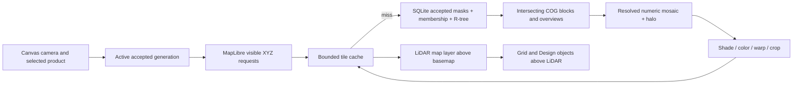

# LiDAR coverage library — revised long-term plan

Status: **proposed architecture; no production implementation**. Revised 2026-09-14 after independent critique. Study `canopi-76zm`; implementation follow-up `canopi-j571`. Chosen UI: Layers inspector with Library drill-in; no canvas shelf or variant chooser. Accepted requirements: built-in and named custom numeric data types, automatic coverage by product, import-time overlap approval with independent uncovered-area selection, and the rendering invariant below. User decisions: R2 removes all LiDAR Fit behavior; R1, R3 and R6–R13 are accepted; R4 and R5 are discarded. Passive LiDAR loading/rendering failures are silent and do not interrupt other content. Accepted architecture is specified below; engine packaging and numerical parameters still require validation. This revision incorporates all user decisions; the prototype and screenshots now demonstrate their selection/import flow in memory.

## Decision and critique

Build a **local indexed raster library**, presented as continuous coverage rather than individual files. SQLite manages metadata, spatial search and revision history; immutable numeric GeoTIFF/COG files hold scientific values; a separate bounded tile cache serves the map. Combine compatible sources virtually. Selecting MNT, MNS or a named custom numeric product displays all compatible, accepted local coverage of that type. Approved imports automatically update that shared surface in every Design displaying it; no per-Design coverage update is required. Preserve immutable survey history internally.

| Weakness in the first plan | Revised decision and reason |
| --- | --- |
| One selected TIFF; mosaics deferred | A Design crossing a tile boundary must see continuous coverage. One displayed product can contain many source tiles from the first useful release. |
| Storage discussion mostly file-oriented | A spatial catalogue is fundamental. Use SQLite R-tree for candidate source footprints and indexed immutable generation membership. Pixel values remain in block-addressable rasters. |
| Per-Design revision pinning in the previous revision | Superseded: save product and display settings only. All Designs follow accepted library coverage automatically; internal generations serve consistency/history, not a coverage chooser. |
| Insufficient policy for overlapping surveys | Review Before/After during import. Explicitly approve replacements and independently select uncovered additions; persist geographic acceptance masks. Newer dates never authorize replacement by themselves. |
| Pre-render every source/style in Mercator | Retain numeric data; generate reusable overviews and requested display tiles. Avoid multiplying full-resolution copies for each style. |
| Hillshade prepared independently per file | Compose compatible numeric coverage before derivatives at source joins. Independent edge treatment can create artificial seams. |
| Whole-image preview with grid underneath | The old prototype did not demonstrate the required composition. The new prototype actually paints LiDAR below grid and all Design objects. |
| Half-second conversion cited as feasibility | Still useful, but proves neither viewport throughput nor large-library performance. Added bounded spatial-query and overlap experiments; packaging and large-raster benchmarks remain gates. |

**Required draw order, back → front:**

`basemap → LiDAR → canvas grid + all Design content and interaction overlays`

Preserve the existing relative order among Design objects/chrome. LiDAR must not cover zones, plants, annotations, Measurement Guides, selection or grid, even at 100% opacity. Basemap labels are part of the basemap and stay below LiDAR. Existing online contour/hillshade references stay independent and above the LiDAR background if enabled; do not silently change their settings. LiDAR does not become a draggable Scene layer or acquire an object hit target. Grid is chrome, not saved raster data.

## Why this storage, rather than “put everything in a database”?

A database can store rasters efficiently **as tiles**, but putting one SQL row per elevation cell would add no useful capability here. The two samples alone contain eight million cells. Map performance depends on spatial indexing, block reads, resolution pyramids, bounded work and cached display tiles—not merely the presence of a database.

| Candidate | Assessment |
| --- | --- |
| **SQLite catalogue + immutable COGs + SQLite display cache** | Recommended for this app: fits existing rusqlite, isolates large assets from settings, retains numerical precision and standard GIS tooling, supports independent source/version recovery. |
| All raster data in GeoPackage | A valid alternative, not technically incapable: its tiled gridded coverage extension supports Float32 TIFF tiles. Attractive for a portable GIS package; weaker fit for a continuously growing multi-survey library because version retention, bulk writes, backup and compaction concentrate in large mutable containers. Reserve as an interchange option. |
| MBTiles/image pyramid as sole authority | Good for rendered map distribution/cache; insufficient as the authoritative scientific dataset without additional numerical encoding/CRS/provenance conventions. Colors cannot recover original heights. |
| One physically merged TIFF per product | Simple initially, but expanding coverage or replacing one survey rewrites large data and obscures provenance. Allow later explicit export, not the library authority. |
| PostGIS/server infrastructure | No current collaboration/server requirement justifies operational overhead for a local desktop feature. |

These tradeoffs are engineering recommendations. Relevant format capabilities: [SQLite R-tree](https://www.sqlite.org/rtree.html), [COG](https://gdal.org/en/stable/drivers/raster/cog.html), [GeoPackage gridded elevation](https://docs.ogc.org/is/17-066r2/17-066r2.html), [GDAL MBTiles](https://gdal.org/en/stable/drivers/raster/mbtiles.html).

### Authorities and physical layout

| Store | Contents and policy |
| --- | --- |
| Dedicated `lidar-library.sqlite` | Service-owned `Mutex<Connection>`, independent schema/migrations, integrity checks and recoverable unavailable state. LiDAR source/interpretation metadata, acquisition intervals and provenance, R-tree footprints, product heads, immutable generations/membership, approved-area masks, import decisions and recoverable journal. Optional collection labels organize inventory only. No millions of pixels or hot tile-cache writes. |
| App data `lidar/sources/<source-sha256>/` | Managed original bytes plus original sidecar/WKT and recovery manifest. Immutable and durable. User can move/delete Downloads after successful import. |
| App cache `lidar/prepared/<interpretation-hash>/<pipeline>/` | Lossless native-grid numeric COG + validity/overview assets when input is unsuitable for random reads. Already suitable COG input can be read directly. Rebuildable from managed originals; no eager per-style full-resolution copies. |
| Separate `lidar-display-cache.sqlite` | Bounded encoded display tiles and derived overview chunks indexed by content key. Own serialized connection, separate from the catalogue and UserDb, so cache churn cannot block Design/settings writes. No connection pools. |
| `.canopi` | Selected product key, visibility, opacity and versioned display settings per product. No pinned generation, source list or coverage manifest. No raster bytes or absolute machine paths. |

UserDb may retain a library-location preference only; LiDAR definitions, masks, receipts and heads belong to the dedicated catalogue. No cross-database atomic transaction is required. Catalogue migration/recovery failure must not block Favorites, Notebook or Design work. Keep catalogue writes short. Finish R-tree cursors and release the LiDAR catalogue lock before processing raster windows. Check bundled SQLite R-tree support in migration tests (`desktop/Cargo.toml` currently uses `bundled-full`), and maintain catalogue/footprint rows in the same transaction. R-tree bounds use finite envelope coordinates for broad-phase overlap; stored double-precision polygon/masks provide exact filtering. Handle longitude wrapping with split index envelopes; Float32 R-tree roundoff is not measurement accuracy. [SQLite R-tree query/rounding behavior](https://www.sqlite.org/rtree.html).

Prepared COGs and rendered tiles have separately visible disk budgets. For the supplied pair, originals plus the measured COG conversion cost about **52.6 MB** before display caches. Show original/prepared/cache usage separately. Estimate and reserve working space before import. Provide consistent library backup/restore and explicit retained-history cleanup with active coverage/undo implications; do not silently purge originals. Missing/corrupt members leave unaffected products usable. Retention duration/space limits need a concrete policy before release. Evict reproducible artifacts, never survey history automatically. Cache quotas must count actual DB/WAL/file allocation; row deletion alone does not guarantee disk shrinkage. Batch access bookkeeping and compact/checkpoint in bounded idle maintenance. Clear cache retains sources and catalogue; rebuilding may show “Preparing view.”

## Domain model and automatic coverage

These terms are proposed feature vocabulary, not additions to the accepted domain glossary yet:

- **Source:** immutable imported bytes identified by SHA-256. Exact reimports under different filenames deduplicate; byte-different TIFFs are not presumed equivalent from names/bounds.
- **Interpretation:** band, product, admitted horizontal CRS, vertical reference/units, valid-data mask, acquisition and quality provenance. Hash separately from source bytes; corrected interpretation gets new identity.
- **Product / data type:** a stable key with a separately editable name and a versioned measurement definition; built-in MNT/MNS and user-created numeric types share one registry. One product exposes all compatible, accepted local coverage as a continuous virtual mosaic. Collections/site labels are optional inventory organization, never a required display selection or coverage boundary.
- **Acceptance patch:** selected uncovered additions and explicitly approved overlap replacements, with exact geographic masks and source interpretations. Rejected areas remain excluded even when their entire source TIFF is stored.
- **Product generation:** an internal immutable snapshot of effective coverage assignments, resolver/grid rules and provenance. A short transaction advances the active product head. Generations support consistent reads, invalidation and history; users do not select or pin them in a Design.
- **Design selection:** product key and display settings. It always follows that product's accepted library head, including subsequent imports. Remember each product's display recipe when switching types.

Suggested normalized tables: `lidar_sources`, `lidar_interpretations`, `lidar_footprints` (R-tree), `lidar_products`, `lidar_generations`, `lidar_generation_members`, `lidar_acceptance_regions`, `lidar_import_jobs` and decision receipts. Use unique hashes, foreign keys and immutable supersession edges. Large exact masks can be content-addressed files referenced by the catalogue; include them in durable backup/recovery. Mutable names do not belong in content hashes. File inventory presence alone never authorizes rendering.

Author optional `lidar` contracts in `common-types`, approximately:

```text
lidar: {
  schema_version, active_product, visible, opacity,
  recipes: { [product_key]: versioned_display_settings }
}
```

No source IDs, region selections or generation hashes are saved in the Design. With MNT selected, all accepted compatible MNT coverage is eligible for rendering; only the visible extent and appropriate resolution are read. Adding adjacent MNT extends coverage automatically. Switching to MNS uses all accepted MNS instead. This remains true after reopen, Save As and selection in a new Design; no reimport or coverage refresh is needed. A new Design may start with LiDAR off, but its product chooser immediately lists the existing local library.

Product/visibility/style edits use `app/design-edit/`, including preview/commit for sliders and normal save/autosave/discard. Shared library publication does not dirty `.canopi` and is not a Design object undo action. Closing a Design does not discard an accepted library import. On another machine the same Design uses that machine's accepted coverage for the selected product; it is not a reproducible survey snapshot. Missing/unsupported products preserve their keys/settings and silently omit the unavailable LiDAR contribution; never silently substitute MNS for MNT or load an unrelated survey.

Use a product registry with capability/compatibility metadata so future products reuse selection, automatic coverage and import review. Same product name alone does not establish compatibility: normalize only through verified horizontal/vertical transforms. Keep incompatible inputs staged with an explanation until admitted into a supported product/reference; do not silently combine datums. Derived height later requires compatible MNT/MNS dependencies and both validity masks; preserve negative differences for analysis.

Current format v5 rejects future versions. Prefer an additive optional field only after proving old/native/Web unknown-field round-trip. Rust `extra` is flattened on disk while frontend uses an `extra` projection; adapt through existing format machinery. Preserve unknown future product keys/recipes in older/Web clients. Web renders no LiDAR initially but preserves these fields. Do not bump the format version casually.

## Custom numeric types

A nonstandard TIFF is not automatically a new type. A custom ground survey can join MNT, and a custom surface survey can join MNS, after compatibility checks. Provider, filename and resolution do not define measurement meaning. If values represent canopy height, intensity or another measurement, offer an existing matching custom type or **Create custom type…**. Never merge unknown files into one “Other” channel.

Import interpretation records selected band, numeric representation, scale/offset, NoData/mask, georeferencing, units and reference provenance. A multi-band numeric TIFF requires a selected supported band; band selection is source interpretation, not type identity. Missing georeferencing must be resolved before canvas placement. Metadata provides suggestions, not proof of meaning; show unresolved information. GDAL exposes bands and their scale/offset, units and validity independently of a user-facing type name. [GDAL raster model](https://gdal.org/en/stable/user/raster_data_model.html).

| Type property | Contract |
| --- | --- |
| Stable ID | Namespaced built-in keys; UUID for custom definitions. Never use a mutable name as identity or infer equivalence from equal names |
| Display name | Shared library metadata; rename keeps Design references intact |
| Meaning | Elevation, height above ground, intensity, or other continuous numeric measurement; not an arbitrary renderer/plugin name |
| Units/reference | Dimension and unit metadata, vertical reference for elevation, relative reference for height, calibration/method context where relevant |
| Capabilities | Allowed display recipes, probing semantics and analysis eligibility derived from meaning and admitted reference; unknown units/reference cannot acquire scientific capabilities merely through naming |
| Definition version | Controlled meaning, unit/dimension and reference/calibration identifiers underpin compatibility; free text is explanation only. Semantic corrections require explicit migration/reinterpretation and new immutable identity where necessary; changing units cannot reinterpret accepted samples in place |

For the first release, support imported continuous numeric rasters, including imported canopy-height data. Computing canopy height from MNT/MNS remains deferred. Categorical labels, RGB imagery, complex-valued bands, arbitrary expressions and custom executable processing are not implied by “custom.” Admit declared numeric types losslessly or reject unsupported representation explicitly; do not coerce every raster to Float32. Return a typed admission result: compatible, convertible by a supported verified recipe, needs interpretation, or incompatible. Unknown references are not equal merely because both are unknown. Normalize scale/offset and convertible units before comparing values; preserve original bytes and interpretation provenance.

Custom elevation with a known spatial placement but unresolved vertical datum can be displayed in its own explicitly unverified channel; it cannot enter MNT/MNS or elevation analysis until compatibility is established. Equal unit names or type labels are insufficient to combine values; intensity can depend on calibration and acquisition method. Unknown numeric data gets a neutral numeric color display, with unknown units labelled as such. Do not show metre labels or terrain relief for intensity. Height above ground is not absolute terrain elevation.

The first import can create the type definition and accepted area patch in one publication. Cancelling the draft creates neither a type nor active coverage. Subsequent compatible imports reuse that type's ordinary overlap review. All accepted custom coverage follows the selected stable ID automatically in every Design, with the same ordering, cache and viewport rules. Initial coverage is empty even where MNT/MNS exists: distinct types do not conflict.

The Design still saves only product IDs and display settings. If a custom ID is unavailable on another machine, preserve it and silently omit its raster; an identically named local type is not an automatic replacement. Copying a `.canopi` alone does not transfer the type definition or rasters. Explicit library backup/restore preserves IDs/definitions/masks; no missing-type notice, restore prompt or relinking workflow is added. General user-initiated library backup/restore remains part of R12.

## Chosen UI and silent LiDAR failure contract

**R1 accepted:** use the existing Layers inspector for data type, visibility, opacity and display style. Its Library button opens inventory, import, custom-type details and history in the same dock, with Back returning to the inspector and restoring focus. Keep the canvas and its camera mounted. Do not ship the alternate library-first layout, bottom canvas shelf or prototype variant switcher; avoid duplicate display controls inside the library.

**R5 discarded:** do not show a “coverage changed since your last visit” notice or track last-seen generations for that UI. All accepted coverage still updates automatically. If a saved selection cannot resolve its type/library/source, or LiDAR decoding/rendering fails, silently skip the unavailable LiDAR contribution. No toast, banner, canvas error overlay, modal, automatic restore prompt or relink flow. Basemap, grid, plants, zones, annotations, interaction and ordinary Design load/save must continue.

Failure is runtime availability, not a document edit. Preserve the exact selected product ID, display settings and unknown fields on save/autosave; do not clear the selection, mark the Design dirty, substitute a matching name, or fall back to another product/survey. Skip failed chunks where independent valid coverage is usable; omit the entire LiDAR surface if its library/product is unavailable. Do not reuse stale pixels from a different product/generation. A later successful resolution of the same saved identity can display normally without confirmation.

Contain failures inside LiDAR setup/query/tile/render ownership. Do not let a LiDAR exception destroy the shared basemap host, Scene runtime or document session. Retain bounded local diagnostics and typed failure outcomes for testing; silent UI does not mean pretending a tile succeeded. Avoid repeated failing work on every frame; retry only through bounded policy or relevant availability/lifecycle changes. No background network recovery or uploaded diagnostics is implied.

This silent behavior concerns passive Design loading and rendering. User-initiated import, interpretation and publication still report their direct outcomes and preserve the explicit overlap-approval contract. General backup/history tools remain available when the user opens the library; nothing opens them automatically because data is missing.

## Import review: add uncovered areas and approve overlaps

**Join compatible tiles virtually. “Overwrite” replaces the active assignment in approved areas, while original surveys remain immutable.** Approval happens once during import, not once per Design. The review must explain: “These changes apply to every Design displaying this data type.” Staged, rejected and incompatible data are not part of “all available coverage.”

For one product, compare incoming valid-data coverage `N` with current accepted valid coverage `E`: uncovered additions are `N \ E`; overlap is `N ∩ E`. Use georeferenced validity masks on a documented comparison grid, not TIFF bounding rectangles. NoData holes in existing data count as uncovered. Preserve exact masks and reprojection/resampling rules; simplified preview polygons are not the acceptance authority. Valid coverage can have arbitrary irregular/ragged outlines, concavities, internal holes, narrow strips and disconnected islands within the rectangular raster storage. Neither a rectangle nor any simplified enclosing polygon may fill gaps or authorize pixels. Spatial chunks organize storage only; they do not define accepted coverage shape.

| Area/import case | Default | User choice and published result |
| --- | --- | --- |
| Incoming valid data with no accepted valid sample | Add | User can deselect individual uncovered regions; selected regions extend shared coverage |
| Both incoming and existing data valid | Keep existing | Show Before/After; replace only explicitly approved overlap regions |
| Incoming NoData over existing valid data | Keep existing | Never erase existing data through ordinary import |
| MNT over MNS, or another distinct product | Independent channel | Not an overlap conflict; each product follows its own review/publication |
| Identical bytes and interpretation already fully accepted | No change | Deduplicate without duplicate coverage; if only partly accepted, review newly proposed excluded areas explicitly |
| Unknown/equal dates or newer but coarser data | Keep existing overlap | Show uncertainty/quality; explicit approval is still required, while compatible uncovered additions can proceed independently |
| Incompatible datum, units or unresolved CRS | Stage affected input | Resolve/verify interpretation before admitting its areas |

The review shows incoming extent, uncovered regions and overlap regions, with independently selectable areas. Link highlighted regions on the map to an accessible selection list; focus/hover identifies the same area. Group tiny fragments for presentation without altering exact masks. Any selection tool must intersect the user selection with incoming valid-data masks and the reviewed overlap decision. Do not constrain source footprints to predefined geometric shapes. Bound mask/list complexity; never handle overload by admitting holes or discarded pixels. Compatible imports use a concise summary/Apply; metadata questions appear only when necessary. Offer “Add uncovered areas,” “Keep existing overlap,” and “Replace selected overlaps.” The user can keep every overlap and add only chosen empty areas, replace some overlaps while retaining others, or cancel. Provide a synchronized Before/After view (swipe or paired views) at identical location/zoom with a fixed elevation range, style and illumination; After shows the proposed accepted patch, not the whole incoming raster. Display source/date/resolution/quality and NoData context. Scope preview raster requests to the viewport and zoom with the same bounded engine as normal rendering.

Use acquisition intervals and documented editions, never modification/download/import dates, to explain chronology. A newer survey may deserve a recommendation but never bypasses replacement approval. Native pixel spacing is not accuracy. Do not average/feather elevations across dates to hide a real boundary. Batch imports must also resolve competing incoming valid samples before publication: no file-order, completion-order or implicit newest winner. Compatible nonconflicting additions can be accepted without accepting those conflicts.

Bind review and exact selected masks to source/interpretation identities and the base product generation. Revalidate at Apply: if another import changes affected coverage, refresh/reconfirm affected decisions rather than applying stale approval. Selections must not expand to newly conflicting areas automatically. Publish selected additions plus approved replacements atomically; retain all other active assignments. An intentionally partial acceptance is a successful import, not an interrupted one. Subsequent cache rebuild, restart or reimport must not reactivate rejected areas or use them as NoData fallback.

After publication, invalidate affected chunks/halos/ancestor overviews and notify every open Design displaying the product. Keep type/style preferences unchanged and update coverage summaries automatically. New Designs use the same accepted head. No manual coverage update, per-Design Apply, or live-latest opt-in exists in this flow. Readiness can show “Preparing view”; it must not change the accepted coverage decision.

Keep prior originals and immutable decisions for library history and undo. Undo is another library-level patch/publication affecting all Designs, with conflict review if later imports changed the same area; it must preserve unrelated later accepted work. Archive is inventory organization, not silent coverage removal. Removing active coverage or purging retained history requires an explicit library action showing its shared effect; missing active assets silently leave their pixels transparent, never an unapproved fallback.

Resolver/recipe versions specify behavior, not just cache namespaces. Engine/PROJ-grid changes must preserve admitted interpretation or create a validated migration; overlap-changing migrations require the same review discipline. Cross-platform numerical tolerances need fixtures. Reproducible exported survey snapshots may be a later explicit feature; do not reintroduce Design revision pinning to provide it.

## Query and rendering architecture

One native **LiDAR subsystem** exposes three coherent caller interfaces: library inventory/definitions, staged import planning/review/publication, and live product views/tiles. Configure storage, engine and executor once. Internally separate numerical resolution, durable publication and scheduling/cache ownership. Import callers exchange opaque review/area identities and receive a publication receipt or stale-review result; tile callers never orchestrate those internal steps. UI callers use product summaries and staged import reviews. A live product handle resolves the active internal generation; map callers ask for `tile(generation, recipe, z, x, y, cancellation)`. Interactive source/value-at-point inspection (R4) is excluded from this release; backend numerical provenance fixtures remain required for correctness. On publication, switch the handle automatically and fence stale tile results; render against one consistent snapshot. Components must not learn source paths, TIFF offsets, GDAL options or overlap rules.



The R-tree answers **which sources might intersect**, not “give me millions of elevations.” A parameterized query intersects tile bounds with generation membership and admitted product, then exact acceptance and validity masks resolve coverage. Never include rejected parts of a stored source. Fetch the small metadata set, release SQL locks, and read only required windows/overview blocks. Index generation membership both by generation and source. Keep query-plan evidence: a spatial index joined badly to a huge manifest can still scan too much. Do not instantiate one MapLibre source/layer for every TIFF.

Use deterministic metric comparison grids per compatible reference region, with explicit pixel-edge/center and resampling rules. Partition exact acceptance assignments, aggregates and history into immutable spatial chunks; generations share unchanged chunks. Apply validity and acceptance before interpolation/aggregation so rejected neighboring pixels cannot leak through a filter kernel. Validate chunk dimensions with fragmented, rotated and misaligned fixtures; no single physical worldwide raster is required.

Use indexed virtual mosaics as the default: current GDAL’s **GTI** supports large raster catalogues and explicit compositing order. Keep its index/VRT manifests derived from immutable application generations and acceptance masks; never maintain two independent authorities. The local GDAL 3.8.4 used in this study lacks GTI (introduced in 3.9). A bounded per-request VRT for already-filtered sources is viable for the first slice; packaging spike should choose/pin a supported engine and verify mask behavior. Do not assume VRT/GTI default file order implements the intended policy. [GDAL GTI](https://gdal.org/en/stable/drivers/raster/gti.html).

### Processing and level of detail

1. Admit/copy/hash once; build lossless native-grid numeric COG overviews when necessary. Preserve Float32/Float64/validity as admitted, with no automatic 8-bit elevation conversion. Preserve original bytes for recovery. Never eagerly produce a full Mercator colored copy for every possible style.
2. Resolve overlaps before derived products. At source joins, assemble a numeric metatile with a stencil halo in an appropriate metric working grid. For admitted elevation products, compute relief/slope using ground units before Mercator warping, or explicitly compensate projection scale. Crop/encode display tiles after processing. Missing neighboring data stays masked; independent edge interpolation must not invent a seam. [GDAL DEM processing](https://gdal.org/en/stable/programs/gdaldem.html), [warp](https://gdal.org/en/stable/programs/gdalwarp.html).
3. Source choice is fixed by the active internal generation and approved geographic assignments, never by zoom or asynchronous arrival. Coarse levels are aggregates of that resolved field. Overlapping independently averaged source overviews can choose the wrong contributor around gaps; build/cache composition-aware numeric overview chunks for affected overlap regions. Non-overlapping compatible source overviews remain reusable. Use a deterministic global grid/halo so adjacent screen tiles agree.
4. For very large coverage, prepare regional/coarse overview chunks incrementally in the background. Do not let one zoomed-out request recursively open every full-resolution source. Until a requested level is ready, show coverage/preparation status or a cached ancestor from the **same active generation**, never stale rejected/replaced coverage. Detail and overview jobs have bounded queues, cancellation, memory and disk usage. Invalidate only changed chunks plus derivative halo and ancestor levels; reuse unchanged content-addressed chunks across generations.
5. MapLibre chooses visible raster XYZ tiles using declared bounds/tile size/source maxzoom; the native service repeats intersection checks, because envelopes include holes. 256-pixel source tile resolution is `2πR cos(latitude)/(256·2^z)` m/pixel: approximately z18 reaches 0.5 m at this site. Use the existing camera adapter, declared tile size and DPR; never derive it from canvas percentage alone. Beyond native resolution, overscale existing data. [MapLibre raster sources](https://maplibre.org/maplibre-style-spec/sources/).
6. Hidden, unlocated, zero-opacity and outside-coverage states schedule no new raster work. Cancel obsolete requests; camera changes remain exact, not throttled by a visual deadband. Opacity is paint-only. Stable color ranges/recipes avoid per-tile contrast seams. Backend correctness fixtures validate numeric authority at the intended resolution, independently of displayed colors or smoothed overview pixels.

One explicit raster scheduler owns bounded/deduplicated queues, cancellation and measurable interactive reservation under the Native Operation Executor. The current Local class runs two operations; four frontend requests do not imply four running decodes. Benchmark imports alongside tile requests, file saves and other native work. Yield preparation in bounded chunks; the packaged spike must decide whether existing Local admission is sufficient or a reviewed raster class is necessary. No nested permits, bypass pools or long-lived worker loop monopolizing a permit.

Initial engineering budgets to measure: 256 px display tiles; at most four frontend requests; deduplicated in-flight keys; one background import and reserved interactive capacity; roughly 128 MiB numeric working/cache memory and 512 MiB rendered tile storage. These are initial controls, not proven global RSS or performance claims. Count GDAL block cache, process IPC, in-flight buffers, GPU textures, numeric/prepared assets and DB/WAL separately. Cap single-job dimensions and source fan-out. A budget failure returns a useful preparation/deferred state, not an unbounded allocation.

Keep MapLibre behind existing Host/Surface Adapter. LiDAR alone must activate Canvas Map Surface with a blank/local-only base style when online references are hidden; no map-network requirement. A single app-owned custom protocol resolves internal generation IDs to native binary tile responses. No base64 elevation arrays, arbitrary paths, widened Downloads access or process-per-tile launches. Cache key includes immutable generation/chunk identity, pipeline, recipe, target grid, LOD and mask/resampling policy. Refcount protocol registration when maps coexist; fence stale callbacks by session/generation and release jobs, listeners, native handles and textures on replacement/teardown/HMR. [MapLibre addProtocol](https://maplibre.org/maplibre-gl-js/docs/API/functions/addProtocol/).

### Layer composition is an acceptance invariant

Place LiDAR inside the low-level map surface above **all basemap layers**, with the map surface itself below the transparent Canvas Runtime/Grid render surfaces. Inspect actual stacking contexts and renderer containers; setting `z-index` on one raster element is not sufficient. Reapply ordering after style reload. Keep hit testing with canvas objects. Source footprint/review outlines are optional inspection graphics, not a new elevation layer; the prototype also draws them below grid/objects. Preserve both Pixi and Canvas2D fallback behavior.

All world-to-screen transforms must share `canvas/projection.ts` and `canvas/maplibre-camera.ts` with saved Location/north bearing. There is no LiDAR Fit, Fit nearby, Fit all, View added areas recentering, or automatic extent fitting. Import and type selection leave canvas pan/zoom and Design origin unchanged. Users navigate with ordinary pan/zoom. Prototype camera reset controls are fixture utilities, not a coverage-fitting feature. Regression images must use fully opaque LiDAR so grid/zone/plant visibility cannot pass accidentally through transparency.

## Import lifecycle, durability and engine choice

Retain a narrow native raster module using pinned **GDAL + PROJ**, preferably a persistent packaged worker if that simplifies crash isolation/distribution. The repo currently lacks this dependency. Validate supported Linux/macOS/Windows packaging, binary size, licences, update/security ownership and resource admission before implementation assumes availability. Do not depend on user-installed Python/GDAL or shell PATH. Pure Rust decoding/projection and browser GeoTIFF processing remain alternatives if this spike fails, not parallel implementations to build speculatively.

`queued → inspect/interpret → copy/hash/validate staging → prepare review → select areas/review overlap → revalidate base generation → prepare accepted patch → publish generation → ready`. A job owns progress/cancellation and per-file results. Discover extensionless TIFFs through magic/driver checks; optional folder import has bounded enumeration. Restrict drivers/inputs to admitted local rasters, not network/VRT/sidecar URLs. Validate file/band/sample type, finite invertible transform, CRS/vertical interpretation, masks, dimensions/decoded size and free space. Stream to staging, then validate copied bytes against source-change races.

Deduplicate under a unique hash constraint. Prepare outside catalogue locks. Atomically rename completed content and exact acceptance masks, then commit source availability, approved membership, decision receipt and product head in one recoverable publication transaction. Before committing, persist required file and directory state using supported platform durability guarantees. Publish an idempotency key and receipt with the catalogue transaction; a retry after a lost reply returns the same receipt. Emit invalidation and acknowledge success only after durable commit. Cancellation before that boundary publishes nothing; after it, return the receipt and offer library undo. User-approved partial area selections can publish; failed, cancelled or incomplete publication cannot change the active head. Staging metadata may be durable without making its pixels active. Crash-injection tests cover every boundary, disk full, cancellation and lost replies. Consistent backup includes definitions, masks, heads and source identities. Startup reconciles staged files, orphaned publications and interrupted jobs without deleting acknowledged sources. Cancellation reaches native work/checkpoints; a JS AbortController alone cannot stop it. Each GDAL handle has one worker/serialized owner. [GDAL threading guidance](https://gdal.org/en/stable/user/multithreading.html).

Keep every native operation executor-backed. The scheduler/admission spike defines the class mapping for bounded file/raster and dedicated-catalogue operations; keep UserDb operations under their existing UserData authority. Do not nest admission or bypass the executor with a new global blocking pool. A persistent child process also needs one explicit app lifecycle owner, bounded command protocol and teardown. Long imports must not monopolize tile servicing. Retain catalogue + source recovery manifests in backups; derived indexes/caches can rebuild.

## Prototype and review evidence

The prototype now follows the chosen Layers inspector + Library drill-in. Run `npm run dev:ui` from `desktop/web`; open [prototype](http://127.0.0.1:1422/?surface=layers&prototype=lidar&panelWidth=380). Earlier variant query parameters no longer select another layout. Screenshots: [Layers inspector](../../desktop/web/ui-gallery/lidar-prototype/screenshots/a-layers.png), [Library drill-in](../../desktop/web/ui-gallery/lidar-prototype/screenshots/b-library.png), [silent missing LiDAR](../../desktop/web/ui-gallery/lidar-prototype/screenshots/c-missing-lidar.png), [import Before/After](../../desktop/web/ui-gallery/lidar-prototype/screenshots/d-update-review.png), [custom type](../../desktop/web/ui-gallery/lidar-prototype/screenshots/e-custom-type.png).

The development-only “LiDAR fixture” selector simulates missing library, missing type and read failure. Each removes the LiDAR drawing/caption/legend/status notices while keeping the rest of the canvas usable and preserving Design preferences. It is a test control, not a production recovery flow. Library → Back preserves camera and restores focus.

Choose a built-in or created custom type once; there is no revision or coverage chooser. Import files first offers an existing destination or Create custom type (name, meaning, units/reference and band), then opens synchronized Before/After with shared zoom/pan and fixed product-appropriate styling. Overlap regions A/B default to keeping existing; uncovered regions C/D default to adding. Toggle each independently, then Apply to shared library or Cancel/Escape. The updated visual fixture includes irregular boundaries, holes and disconnected islands. Masks are schematic; arbitrary real-raster mask extraction remains a backend gate. Import never adjusts the canvas camera. Select the same type in the New Design to see accepted coverage automatically. New custom types begin empty; accepted custom areas are schematic, with no borrowed MNT/MNS pixels. Library type details allow rename while retaining ID. Library history offers demo undo across Designs; product display styles remain independent. Full-opacity grid/objects and plant selection remain above LiDAR.

Only the **2025 raster is measured data**. Incoming irregular ochre patches are explicitly synthetic visual fixtures, not measured 2026 elevations. The prototype compares acceptance masks visually; it cannot establish geospatial validity or actual changes in elevation. Plants, Zone, guide, annotation and basemap are schematic. No native import, reprojection, disk persistence, concurrent publication/conflict handling, native product registration or production tiling is implemented. PNG previews load a visible source image per overview, not tile windows. Demo undo reverses the latest in-memory import; production requires the conflict safeguards above. All state resets on reload; no real Design/store is touched.

All prototype code/assets remain under `desktop/web/ui-gallery/lidar-prototype/`, gated in the development gallery. No runtime dependency or production entry is changed. Reuse `DockPanelHeader`, `PlantSymbolGlyph` and design tokens; rebuild accepted behavior through production gates.

## Implementation slices and gates

Decision details and weaknesses are in [the review](lidar-library-review.md). R2 is revised to remove Fit; R3 and R6–R13 are incorporated here. R1 selects Layers + Library drill-in. R4/R5 are discarded: no interactive point inspection, reopening notice or missing-type recovery prompt. Implement silent LiDAR failure as specified above; all review decisions are settled. The implementation scope is tracked by `canopi-j571`; these slices define acceptance and ordering, not a second tracker.

| Slice | Acceptance |
| --- | --- |
| 1. Packaged vertical slice | Before broad UI work, prove original extensionless MNT/MNS and custom elevation/height/intensity fixtures through import → review → durable publication → actual tile → restart/shared selection, interrupted import and missing-source recovery. Pinned packaged engine on supported OS targets; R-tree query plans; native CRS defect handled; tiled window reads and cancellation proved; lossless numeric/mask round-trip |
| 2. Durable catalogue and immutable imports | Reimport dedup; copies and exact acceptance masks survive original-path loss/restart; atomic publication/recovery; catalogue/source backup/restore; bounded preparation |
| 3. Product coverage and import decisions | All accepted compatible coverage per type; valid-area classification; independent additions/replacements; keep-existing default; explicit overlap approval; batch/stale-review conflicts; immutable history and safe library undo |
| 4. Design UI and map surface | Stable custom IDs/definitions and type/settings save/autosave/reopen/Web round-trip; import Before/After and area selection; automatic updates in every Design without dirtying it; chosen inspector/drill-in with no shelf; silent missing/type/read failure preserving other canvas content and saved preferences; one tiled layer; exact alignment; full-opacity draw-order and hit tests |
| 5. Scale and operations | Large index and overlapping rasters; incremental overview/cache invalidation; worker teardown; disk quota/compaction; packaged WebView validation |

First useful release includes all accepted compatible coverage by type, automatic shared updates, import Before/After and independent area approval, internal history/undo, and a single active built-in or custom numeric display. Custom numeric import does not add computed derived products. Defer derived heights, advanced survey-comparison analytics, reproducible snapshot export, physical mosaic export/GeoPackage, sharing packages, LAS/LAZ/3D, PDF backgrounds and Web rendering. Import comparison and automatic coverage are core, not deferred options. Do not overbuild those to obtain solid fundamentals.

Implementation entry points (repo-relative):

| Responsibility | Existing/new seam |
| --- | --- |
| Contracts/format | `common-types/src/design.rs`, `bindings-gen/`, `desktop/src/design/format.rs`, frontend generated facts and Design adapters |
| Native library | New `desktop/src/services/lidar/`, `commands/lidar.rs`, `db/lidar.rs` with its own migration registry; `lib.rs`, Native Operation Executor/command policy |
| Frontend orchestration | New `desktop/web/src/app/lidar/`; Design writes under `app/design-edit/lidar.ts`; edition capability supplied at composition root |
| Layer presentation | `app/canvas-layer-presentation/presentation.ts`, `components/panels/LayersPanel.tsx`, `components/canvas/LayerPanel.tsx` |
| Surface activation/rendering | `app/canvas-map-surface/{types,snapshot,reconciliation,lifecycle}.ts`, new `maplibre/lidar.ts`, existing Host/Surface Adapter |
| Projection/lifecycle | `canvas/{projection,maplibre-camera}.ts`, existing document-session replacement and runtime cleanup seams |

Keep leaf controllers independent. Higher workflows coordinate library publication/subscriptions separately from Design Edit for product/display preferences. Runtime readiness, cache state and library head are not document authority. Avoid rebuilding Scene snapshots on camera changes just to read LiDAR settings.

Regression fixtures: adjacent edge crossing; partial newer overlap; NoData/NaN/zero/negative heights; authoritative void; unknown/equal/overlapping acquisition dates; later edition of old acquisition; newer coarse data; mismatched vertical references; rotated transforms; arbitrary ragged/concave masks, holes, disconnected islands and thin strips; interpolation near rejected cells; immutable chunk sharing; boundary rounding; duplicate bytes/renamed paths; missing active source; selected uncovered-only import; selectively replaced overlaps; rejected masks surviving restart/cache rebuild/reimport; incoming-batch conflicts; stale review; undo preserving later unrelated imports; all open/new/reopened Designs following accepted product heads; custom creation cancellation; custom rename preserving IDs; measurement-specific display capabilities; unsupported band rejection; units/scale/offset/reference compatibility; missing custom ID without name substitution or notification; save/autosave preservation through silent failures; LiDAR init/query/tile failure without Scene/basemap teardown; no retry storm; library Back focus/camera preservation; unknown future product round-trip; interrupted publish at every durability boundary; duplicate/lost-response idempotency; catalogue failure isolation; unchanged camera after import/type selection; style reload and successor Design cancellation. Use small synthetic committed rasters, not the Downloads as test dependencies.

Within one active generation, prove identical point provenance across zoom/style changes, correct halo/no seams, mixed-date labels, no reads while hidden/unlocated/zero-opacity/outside, and no priority changes from asynchronous result order. At opacity 100%, check grid, zones, plants, guides and selection above LiDAR with basemap beneath it, at DPR 1/2 and nonzero bearing in Pixi and Canvas2D.

Performance goals on named hardware: responsive ≥55 fps pan/zoom, no raster main-thread task over 50 ms, prepared warm tile p95 <100 ms and prepared cold tile p95 <500 ms. These exclude initial preparation, which needs its own duration/progress/cancel measurements. Test a catalogue with ≥100,000 footprints and rasters exceeding RAM, including overlapping epochs; log bytes/overview/source fan-out/latency/RSS/GPU/queue/cache metrics. Incomplete preparation must remain bounded rather than pretend to satisfy the latency goal.

Production gates: focused import/cache/resolver/Design/projection tests; full frontend suite for shared map runtime; TypeScript/gallery checks; both edition builds; generated bindings regeneration/check; Rust fmt/Clippy/workspace check/tests and `native_command_policy::tests`; packaged OS/WebView checks. Update `docs/agent/maplibre.md`, `document-lifecycle.md`, `build-release.md`, the Layers guide and domain terminology when implemented. This proposal does not override current operating docs.

## Local feasibility evidence and limitations

`mosaic-study.py` uses system GDAL and a disposable synthetic old/east/new raster trio. The virtual mosaic joins adjacent tiles, renders a preassigned newer valid overlap, fills a newer NoData cell from older data and leaves originals unchanged. This demonstrates scalar composition only, not user approval, persistent acceptance masks or automatic shared publication; its fixed priority is not the import policy. A 100,000-entry in-memory SQLite R-tree query returns 25 candidates with a virtual-table spatial plan; 1,000 warm queries averaged **0.017 ms** on this machine. This is not a persistent-DB/IPC/renderer benchmark. [Script](../../desktop/web/ui-gallery/lidar-prototype/mosaic-study.py), [recorded output](../../desktop/web/ui-gallery/lidar-prototype/mosaic-evidence.json).

The original native-COG conversion experiment used GDAL 3.8.4, DEFLATE, floating-point predictor, 512×512 blocks and average overviews. One local run: MNT 0.541 s / 9,987,540 bytes; MNS 0.482 s / 10,628,241 bytes; overview sizes 1000² and 500². No reprojection, GTI or packaged binary was exercised. These observations support feasibility, not the unverified performance goals above.

The original source evidence follows unchanged; no extra survey has been discovered or downloaded.

## Inspected files: evidence, not assumptions

Both folders are under `/home/daylon/Downloads/`:

- `LHD_FXX_0446_6807_MNT_O_0M50_LAMB93_IGN69/`
- `LHD_FXX_0446_6807_MNS_O_0M50_LAMB93_IGN69/`

Each contains a **GeoTIFF with no extension**, named identically to its folder, plus a same-stem `.json` sidecar. File dialogs need an “All files” option; inspect magic bytes/GDAL driver, not suffix alone. These are elevation rasters derived from LiDAR, not point clouds.

| Property | MNT: ground | MNS: surface, including vegetation/buildings |
| --- | --- | --- |
| Bytes | 16,000,513 | 16,000,513 |
| Grid | 2000 × 2000, one Float32 band | Identical |
| Resolution/coverage | 0.5 m; 1000 × 1000 m | Identical |
| Observed min/max | 141.5031 / 181.0456 m | 141.5031 / 199.8624 m |
| Valid cells | 4,000,000 | 4,000,000 |
| Declared NoData | −9999 | −9999 |
| Storage | Strip blocks 2000 × 1; no overviews | Identical |

Geotransform: `[445999.75, 0.5, 0, 6807000.25, 0, -0.5]`, `AREA_OR_POINT=Area`. Projected pixel-edge bounds: west `445999.75`, south `6806000.25`, east `446999.75`, north `6807000.25`. Upper-left pixel **center** is `(446000, 6807000)`; do not shift another half-pixel.

GDAL-derived WGS84 envelope: west `−0.4271195`, south `48.3047203`, east `−0.4130609`, north `48.3140987`. Approximate center: `48.3094° N, 0.4201° W`. These values are inspection evidence using the embedded WKT, not an independent survey check. A warped footprint is a polygon, not a square aligned to longitude/latitude.

Sidecars describe a WMS `image/geotiff` request with `CRS=EPSG:2154`; `metadata` is itself a **JSON-encoded string**, requiring a second parse. They report acquisition **2025-02-15**, edition **2025-07-23**, mission `24LHDGF2`, horizontal `LAMB93`, vertical `IGN69`. The reported 17,530,002 source points are acquisition metadata, not raster cell count. Sidecars are optional provenance; never refetch their URLs automatically.

**CRS trap:** WKT is named `EPSG:2154`, but contains an unnamed datum and a fallback WGS84 ellipsoid without a root authority ID. GDAL 3.8.4 `AutoIdentifyEPSG()` returns error 7 and no code. Do not require an embedded authority code, and do not silently trust the name. For these files, propose Lambert-93 after checking projection parameters and sidecar agreement; show the proposed CRS in import review and record the override/provenance. For ambiguous/conflicting inputs, require user CRS selection or reject with a precise reason. Keep original bytes/WKT. Heights are labelled IGN69 by metadata, not proven by a vertical GeoTIFF CRS; do not reinterpret as ellipsoidal height. **0.5 m is pixel spacing, not an accuracy guarantee.**

Aligned MNS−MNT values span `−0.32884…34.69498 m`; 4,141 cells are negative. A later height product needs matching grids, datums, acquisition dates and valid masks; preserve signed differences for analysis and distinguish any display-only clamp from measured values. Do not label this pair “tree heights.”

Reproducible inspection, hashes and preview generation: [`generate-previews.py`](../../desktop/web/ui-gallery/lidar-prototype/generate-previews.py), [`input-evidence.json`](../../desktop/web/ui-gallery/lidar-prototype/input-evidence.json). Script uses this machine’s `/usr/bin/python3`, GDAL and NumPy. It reads originals and writes only prototype assets. No Downloads files were changed.


## Study verification

The updated prototype passed `npx tsc --noEmit`, `npm run check:ui`, and focused gallery Vitest (2 files, 6 tests). Browser verification covers custom create/cancel/rename, numeric display capabilities and selected bands, alongside default keep-existing behavior, selected overlap plus selected uncovered additions, uncovered-only acceptance, shared coverage across sample Designs, product isolation, synchronized comparison camera, Cancel/Escape/focus restoration, library undo, full-opacity composition/hit testing, hidden/outside/unlocated states and inspector/library layouts at 1440×1000 and 1024×768, including dark import review. Latest decision update verified removal of Fit and variant/shelf controls, unchanged camera after import/type selection, irregular masks with holes/disconnected islands, selective publication and custom cancellation. The current run additionally verifies silent missing-library/type/read failures, unchanged preferences, object interaction, actual blocked-image handling and Library Back focus. All five screenshots were refreshed; normal-load browser console had no errors; deliberately aborted image requests exercised silent read-failure handling. Local handoff links and `git diff --check` passed. See study bead `canopi-76zm` for the completed run evidence.

These checks validate the throwaway interaction, not real TIFF import or persistence/performance. Original source inspection and local mosaic/index feasibility evidence remain as recorded above. Prototype README, screenshots and this handoff are updated. Current agent guides need no changes because production architecture/commands remain unchanged. The user authorized committing and pushing the complete study/prototype after reviewing the decisions.
