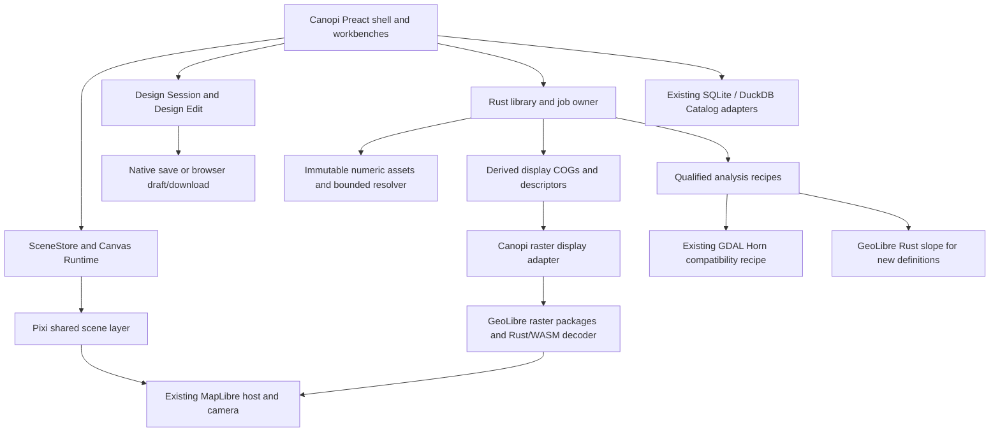

# Canopi application plan: reuse GeoLibre, preserve Canopi

Status: proposed — complete application migration proposal; upstream display semantics, existing edition scope and GeoLibre slope for new analyses accepted by the user on 2026-09-24. Implementation is not yet authorized.
Tracking: user-requested planning; create execution beads only after authorization. Existing raster qualification remains in `canopi-j571.3` under `canopi-j571.1`; it is not silently replaced by this proposal.
Current guidance: [architecture ownership](../../workflow/architecture-ownership.md), [edition development](../../agent/edition-development.md), [Canvas](../../agent/canvas-runtime.md), [MapLibre](../../agent/maplibre.md), [LiDAR](../../agent/lidar.md), [Design lifecycle](../../agent/document-lifecycle.md), [database](../../agent/database.md), and [interface contract](../../../.interface-design/system.md).

## 1. Outcome and scope

Deliver a functional Canopi application with its existing capabilities, a responsive geospatial workspace, and coherent Data, Analysis and Layers interactions. Use GeoLibre's maintained libraries and suitable source modules for geographic infrastructure. Keep Canopi's botanical design product, TypeScript/Preact UI, Rust native application, existing data, and ownership model.

This is a whole-application plan. Raster display is its first infrastructure replacement, not its completion criterion. Completion includes canvas tools, plant discovery and placement, planning, persistence, exports, both editions, installation and recovery. Some areas need integration checks rather than rewrites because GeoLibre has no equivalent for their Canopi semantics.

The delivery is an incremental migration in the Canopi repository. It does not fork the entire GeoLibre application and then port Canopi into its React/Zustand project model. The reusable geospatial implementation comes from upstream; Canopi retains the domain application and the thin adapters that connect it. Installing a dependency with unused functions is acceptable. Activating another application store, document history, camera or job owner is not.

### Product decisions and remaining proposals

The user accepted decisions 1–3 on 2026-09-24. Decision 4 remains the proposal's Design-format preservation default. Acceptance of these product choices does not authorize implementation of the whole plan:

1. **Accepted: upstream display behavior.** Use GeoLibre's standard overview/resampling and mosaic display behavior. At overview scales, the picture may differ from Canopi's current reduction of the exact composed native grid. Numeric inspection, source priority, analysis and saved results remain exact under their existing rules. Section 5 specifies this narrow amendment.
2. **Accepted: current edition capabilities.** Desktop retains local Data/Analysis; Web retains its existing Design, canvas, Catalog, Location and basemap capabilities and preserves unavailable local dataset references. Adding browser raster import/analysis is a separate product increment, not an implied requirement of using WASM on Desktop.
3. **Accepted: GeoLibre slope for new analyses.** New Slope definitions use the pinned GeoLibre projected method with explicit method/version provenance. Preserve existing Horn definitions, results, units and quality rules; their Retry and automatic refresh continue to use Horn. Section 5 fixes dispatch, numeric policy and compatibility; this approval does not silently recalculate old results.
4. Preserve `.canopi` file format v6 and supported admission behavior. A versioned library-catalog migration records the new analysis method and protects older-binary compatibility; it does not introduce an implicit Design converter or remove an existing feature.

If the user changes one of these choices, revise its affected sections before implementation. Exact legacy display reduction would require a different display preparation contract; full Web processing would require browser storage/admission design. The approved slope change is governed by the recipe-version and scientific expectations below. These are material choices, not implementer discretion.

### What the user should be able to do at completion

Open an existing Design; find a plant in the Catalog; place and edit plants/zones/annotations; locate the site; import and organize terrain data; see it promptly; run and inspect slope; adjust presentation without recomputing science; continue Calendar/Budget/Consortium work; save, reopen and export; recover from failed jobs and unavailable maps without losing work. All existing commands and supported edition differences remain accounted for in section 3.

## 2. Inspected evidence and its limits

Research date: 2026-09-24. Application baseline: integrated Canopi `e01e7d077ed480c6fe32383018c2ffd8e929cd0c`, following candidate `1bcf8060`. The [integration receipt](completion-receipt.md#integration-for-user-review--2026-09-24) retains earlier gate evidence. The user's slow display and poor UX reports are acceptance failures; the previous test totals do not overturn them.

| Inspected source | Finding and consequence |
| --- | --- |
| [GeoLibre `68598ba4`](https://github.com/opengeos/GeoLibre/tree/68598ba40dcc295e40d5e952f3c25b0cafa644c0) | Its raster plugin defaults to `cog-tiler-wasm`, with local range-readable Tauri asset URLs. Other API routes can choose another engine. Reuse the actual route; do not infer that every upstream raster path is identical. |
| [Raster plugin](https://github.com/opengeos/GeoLibre/blob/68598ba40dcc295e40d5e952f3c25b0cafa644c0/packages/plugins/src/plugins/maplibre-raster.ts) and [Tauri file integration](https://github.com/opengeos/GeoLibre/blob/68598ba40dcc295e40d5e952f3c25b0cafa644c0/apps/geolibre-desktop/src/lib/tauri-io.ts) | Useful integration evidence for initialization, style reloads, local URLs, codecs and WebKit. Copy only fixes reproduced against the selected dependency versions. Do not copy its whole app/plugin state. |
| Published `maplibre-gl-raster@0.14.15` and `cog-tiler-wasm@0.4.0` tarballs | Public `LayerManager` supports headless control of display; the internal `CogTilerEngine` is not a public import. Tiler supports source windows, overviews and projection. Its default per-source cache is not a global memory limit, and it has no complete public cancellation/disposal surface. These are integration gates, not assumed properties. |
| Published `@geolibre/map@3.0.0` and `@geolibre/core@3.0.0` tarballs | The headless map bundle imports the core barrel. The core bundle creates `useAppStore` and subscriptions at module scope and imports Zustand. The package also declares React/other renderer dependencies. Its README's headless description is insufficient proof of application isolation. Do not import these root packages into production unchanged. |
| [Headless map API](https://github.com/opengeos/GeoLibre/blob/68598ba40dcc295e40d5e952f3c25b0cafa644c0/packages/map/src/headless.ts) | `createLayerSync` explicitly does not preserve placement relative to unmanaged layers. Canopi's Pixi scene and overlay bands therefore still need their existing stack owner. Useful independent exports/source modules can be reused separately. |
| [geolibre-rust `aac2b743`](https://github.com/opengeos/geolibre-rust/tree/aac2b743978666f3c3119b5c93de1b30963b1493) | Native `cargo check --locked -p geolibre-cli` passed on this Linux host, with a separate target directory. The Rust CLI is a viable build route without Python. No native operation, release binary, resource limit or cross-platform package was proven by that check. |
| [Native tool runner](https://github.com/opengeos/geolibre-rust/blob/aac2b743978666f3c3119b5c93de1b30963b1493/crates/geolibre-cli/src/main.rs) and [raster I/O helper](https://github.com/opengeos/geolibre-rust/blob/aac2b743978666f3c3119b5c93de1b30963b1493/crates/geolibre-tools/src/common.rs) | The runner exposes tool IDs/manifests and file-path execution. Many tools load full rasters. The browser WASI wrapper stages files in memory. Neither is an unqualified replacement for Canopi's bounded large-data jobs. |
| [Pinned Whitebox terrain implementation](https://github.com/opengeos/whitebox-wasm/blob/9c0ff4fdf3513f27b89c78e294610c3b418b3a4f/crates/wbtools_oss/src/tools/geomorphometry/basic_terrain_tools.rs) | Projected slope uses a 5×5 Florinsky calculation; its manifest text describes a different stencil. Read implementation and verify numeric results instead of generating Canopi's scientific contract from descriptions. Existing Canopi uses GDAL Horn with a one-cell halo. |
| Canopi `prepared_raster.rs`, `tiles.rs`, `raster_assets.rs` | Prepared numeric COGs deliberately have no overviews and one uncompressed base level. Non-Mercator display requests can transform a 257×257 lattice in 4096-point GDAL batches. These explain substantial avoidable work; a complete latency attribution still needs the benchmark below. |
| Live existing UI gallery | On the baseline, Desktop `?surface=workspace` throws `missing surfaces: data, analysis`; Web throws `missing surfaces: location`. Reproduced with the actual gallery on a spare port. Typechecking the gallery did not establish that either workspace mounted. Repair these fixtures before relying on them for UI review. This does not establish that the production app has the same registration failure. |

The pinned native Whitebox revision is already used by Canopi's `wbgeotiff` dependency. Reuse has begun; the missing piece is using an appropriate complete display path and qualifying its composition with the application. This research did not measure a migrated Canopi renderer, verify packaged WASM, or certify all GeoLibre capabilities as suitable for Canopi.

Research scratch trees and logs under `/tmp` are disposable. Reproduce the source/artifact inspection from the revisions above; do not make temporary paths build or test dependencies. Initial offline native checking failed because a dependency was not cached; the subsequent network-enabled locked check succeeded. Record the successful compilation separately from runtime evidence.

## 3. Whole-application feature and reuse map

Each row is a delivery obligation. “Keep” means preserve and test it in the combined app, not leave it out of the plan.

| Canopi capability | Implementation decision / upstream reuse | Completion proof |
| --- | --- | --- |
| App startup, Welcome, New/Open, Recent Designs, Notebook, dirty close guard | Keep the Canopi shell, command graph, session and Notebook. Do not adopt GeoLibre project serialization or startup store. | Create/open/switch/cancel a dirty replacement, recover an autosave, reopen from Notebook; startup works with maps unavailable. |
| Canvas navigation and rendering | Keep MapLibre camera authority, shared Pixi custom layer, local-metre frame and Canvas2D fallback. Reuse the same MapLibre engine/version used by the adopted stack. | Pan/zoom 0–27, Return, resize, rendering failure/fallback and restoration; no duplicate camera or render loop. |
| Canvas tools and editing | Keep plants, all Zone forms, annotations, groups, selection, locks, guides, grid/snap/ruler, stamps, undo/redo and command shortcuts in SceneStore/runtime. GeoLibre vector editing does not replace these semantics. | Existing command/tool suites plus a driven edit/undo/save/reopen journey over an active raster. |
| Plant appearance and identification | Keep Species Key/codes, focus, symbols/colors, detail policies, hover/selection and Target overlays. | Colors/symbols, codes and locks survive migration; map interactions do not consume canvas gestures or obscure overlays. |
| Species Catalog, filters, details, Favorites and placement | Keep authored catalog contracts and full Desktop/reduced Web readers. GeoLibre's DuckDB GIS tables are not the botanical catalog. | Search and filter in multiple languages, detail/favorite/place, stale search cancellation and browser artifact admission. |
| Calendar, Budget, Consortium | Keep planning projections, civil-date rules, Design Edit, dock state and exports. There is no useful GeoLibre replacement for these product rules. | Editing a plant or plan updates relevant projections; switching Designs clears session view state correctly; exports and dirty state remain correct. |
| Location, coordinates, Desktop search and template world map | Keep workbench transactions, placement confirmation and provider policy. Reuse upstream coordinate/extent utilities only where they replace existing generic work with equivalent behavior. | Provisional/confirmed placement, bearing, undo, wrap/world copies, Desktop search, browser-safe Location, template preview/import. |
| Basemaps, hillshade and contours | Keep existing provider credentials/attribution lifecycle and `maplibre-contour`, already a standard library. Reuse upstream MapLibre/COG terrain helpers only for an actual accepted caller; local DEM terrain is not added just because a helper exists. | Provider failure/withdrawal, credit, hide/show, style reload, contour/hillshade controls; no key in saved state/logs. |
| Data import and library management | Keep library identities, originals, ordered sources, heads/history, dependencies and transactions. Reuse upstream COG metadata readers and range transport; use standard COG preparation for display. | Import/cancel/retry; multiple sources; reorder/remove/undo/restore; existing library still opens; deletion impact and Remove-from-Design are distinct. |
| Raster display and inspection | Replace Canopi's expensive native PNG tile route with the upstream renderer and display COGs. Keep native exact numeric inspection and head fences. | Actual map first-paint/pan metrics, native range reads, correct layer bands, NoData/units, latest-only inspection and offline use. |
| Analysis and result management | Keep named saved definitions, eligibility, job ownership, automatic refresh, cancellation, Retry and publication. New definitions use GeoLibre Slope; existing definitions retain Horn. Persist method/version and expose it in result details. | UI → action → IPC → native operation → published result → map → inspection for both methods; failure preserves previous results. |
| Layers, data filters and styling UX | Retain one Layers presentation owner; use upstream style state/metadata behind Canopi controls. Data owns library organization; Analysis owns runs. | Clear selection/visibility/order/opacity distinctions; filter/reset behavior; no duplicate library mutations; all current actions reachable. |
| Design persistence and interoperability | Keep `.canopi` v6, extra-field preservation, Scene/document ownership, atomic native saves and browser drafts/downloads. Runtime URLs and upstream objects never enter the Design. | Native/Web conformance corpus, dirty/save races, unknown fields, cross-edition roundtrip with unavailable local references preserved. |
| Canvas PDF, image export, Budget export and saved stamps | Keep existing export authorities and capabilities. GeoLibre map capture cannot replace a botanical field-sheet exporter. PDF backgrounds remain deferred under ADR 0024. | Preview/cancel/deliver/reopen exported artifacts; no dirty-state acknowledgement or scene mutation from export. |
| Themes, 11 languages, keyboard/pointer accessibility, responsive dock | Keep Preact, CSS Modules, shared controls and i18next. Reuse upstream interaction ideas and pure models, not its React component hierarchy/CSS framework. | Real long translations, narrow/short windows, light/dark, focus return, Escape, keyboard input and persistent actions. |
| Settings, diagnostics, updates/build/release and edition boundaries | Keep current platform adapters, credential boundaries and Problem Reports. Add packaged upstream assets and licenses through existing build/release tooling. | Clean install/offline start, privacy-safe diagnostics, both builds, native package smoke and platform matrix. |

Inventory production command registrations and existing entry points in S0. A capability absent from the table must be classified and preserved before a deletion is accepted. Do not use this table to narrow already shipped behavior.

## 4. Architecture and code reuse decisions

### Dependency disposition

| Source | Decision |
| --- | --- |
| `maplibre-gl-raster@0.14.15`, `cog-tiler-wasm@0.4.0` | Adopt the public vanilla `LayerManager`, explicitly selecting WASM, behind one Canopi display adapter. Validate actual npm declarations and production bundling in S1. Do not deep-import the private engine or use the React entry. |
| MapLibre / `geotiff` / `proj4` | Start the proof at upstream's inspected MapLibre 6.10.0, GeoTIFF 3.0.5, proj4 2.22.0; pin the successfully qualified set and deduplicate MapLibre. Upgrade and test the Pixi custom layer together. Avoid floating dependency changes during acceptance. |
| `whitebox-wasm` and `wbgeotiff` | Preserve the native pin unless a required, tested change warrants updating it. Bundle the exact WASM/codecs selected by the tiler. Native and browser use of related source does not by itself prove identical precision or NoData behavior. |
| `@geolibre/map` / `@geolibre/core` | Do not use their current barrels as Canopi application infrastructure. For an independent useful function, prefer its existing underlying library; otherwise vendor the narrow source module and necessary pure dependencies with provenance. Examples include COG metadata/coordinate helpers; no unused utility collection. A future upstream pure entry may replace that vendor copy after verification. |
| GeoLibre app source | Adapt the proven local asset URL/initialization patterns, relevant codec fixes and useful parameter/metadata presentation models. Replace only environment hooks with Canopi adapters. Retain upstream attribution/license and tests where applicable. Do not pull in its plugin host, project store, Python service or scripting system. |
| `geolibre-rust` native tools | Adopt the pinned native CLI for new Slope definitions, as a job-owned child process with argv, job scratch paths, bounded inputs, kill/reap and validated outputs. Build and package the binary per platform; the all-tools registry may remain compiled while Canopi exposes only its qualified recipe. Existing Horn definitions retain GDAL. No Python/WASI virtual-filesystem detour on Desktop. |
| GeoLibre DuckDB/SQL machinery | Keep current catalog readers. No SQLite → DuckDB migration or SQL console is necessary for the same-feature application. Reuse a spatial SQL package only when a separately authorized geographic query requires it. |

A native GeoLibre recipe must declare its tool/version, mathematical method, units, supported CRS, NoData/quality policy, whole-input versus windowed execution and tested resource envelope. Whole-raster tools cannot be made correct merely by cutting arbitrary chunks. Neighborhood tools need their actual halo; global hydrology needs a separately designed algorithm boundary. These rules prevent the next cycle of “all tests green” with different scientific meaning.

### Boundaries to keep small

- Extend the existing `maplibre/` and `app/canvas-map-surface/` seams. One adapter owns the upstream manager per live map; no general GIS facade, renderer framework, second map or app-wide event bus.
- `app/lidar/` keeps action/workflow/library-read ownership. Components consume read models and call actions; they do not manage assets, engine objects or publication transactions.
- Rust `services/lidar/` owns immutable numeric generations, derived display artifacts, bounded I/O, jobs and recovery. `commands/lidar.rs` stays executor-backed. No raster work in synchronous commands.
- SceneStore and Design Edit retain their existing split. GeoLibre objects are disposable render/compute objects, never an additional authority for Design data, dirty state or history.
- Keep stable public `lidar_*` identities during migration. Do not rename the entire subsystem to `geo` while changing behavior. Internal module names can describe display preparation and adapters without a broad move-only rewrite.

### Reuse maintenance contract

For each vendored/patched module, keep one provenance record: upstream repository, exact commit/package version, original paths, license, local changes, why an unchanged package cannot serve the caller, and tests covering the change. Prefer package imports; use source reuse where the published boundary is coupled. Keep notices in the shipped third-party notices. No permanent application fork or automatic upstream syncing.

Permitted initial downstream changes are narrowly limited to the adopted renderer boundary: correct declaration defects, expose a worker-compatible render/close hook, honor bounded resource/cancellation settings, and surface incomplete mosaic/errors. Do not copy a replacement decoder, warp algorithm, pyramid selector, colorizer or mosaic compositor into Canopi. If adoption needs a wider engine rewrite, stop that slice with the failing production proof and a revised recommendation; proceed with independent UI/parity work.

## 5. Geographic data, rendering and scientific contracts

### Numeric authority and display artifacts

Keep the existing controlled Float32 numeric profile and reader contract. It requires one base level; simply enabling overviews in that file would break it. Add a separate, versioned **display derivative** profile: tiled COG, lossless compression supported by the pinned decoder, and valid-data overviews down to a small overview. Start with DEFLATE and 256-pixel blocks to minimize codec differences. Keep native CRS; use upstream display reprojection.

Create derivatives from managed immutable assets, keyed by asset content identity plus display-profile version and any required unit transformation. A derivative is regenerable display data, never a new source member, a source head, or an analysis result. Source originals and exact numeric generations remain intact. Existing valid derivatives are reused across Designs and undo/restore.

New import stages its required display assets under the same job before final publication. Failure/cancellation before publication leaves the old head and no partial successful import. Existing libraries receive lazy, recoverable derivative preparation for visible assets; the UI distinguishes preparing display from missing scientific data. Do not force a full-library rewrite at startup. Numeric inspection/history remain available independently.

Previous-composition members retain their exact historical numeric resolver. For their display, use existing occupied numeric chunks or bounded windows to create sparse display COG parts. Never reinterpret an old masked merge as a new source-priority list. Empty geographic gaps do not become dense allocation or a mandatory full-union COG.

### Explicit display amendment

Under the user-accepted display decision in section 1, native-cell topmost-valid composition remains authoritative for numeric reads and analysis. Display uses upstream per-source overviews, the saved source priority and transparent NoData. It uses one layer-wide stretch, units and legend, not a different automatic scale per member. At low zoom this is a visualization of the collection, not its exact reduced numeric grid. This is the accepted migration target, not a claim that the current renderer has changed.

Example proving the distinction: upper source `[100, NoData]`, lower source `[0, 0]`. Exact composed-cell mean is `50`; independently reduced upper-source display can show `100` over that footprint. The implementation must preserve numeric inspection and analysis while testing/recording this allowed visual difference. This is why adopting a stock mosaic is an explicit amendment of [ADR 0027](../../adr/0027-ordered-cog-data-layers.md) and the [ordered composition contract](ordered-cog-design.md), not a claim of pixel equivalence.

ADR 0027 and the ordered composition contract now record this accepted display amendment. During implementation, migrate old exact-display tests to the accepted behavior while preserving their numeric cases and exact priority/validity, history and analysis rules. Do not quietly delete the tests to get the package green.

Preserve quantity meaning: `Percent` slope is not passed to a degree-colored renderer as though it were degrees. Use the upstream style in the actual stored units with a matching legend; a degree-based display requires an explicitly keyed derived conversion. Existing custom ramps may be mapped to a documented upstream palette with the updated legend under the display amendment; do not claim the old ramp is retained if the public WASM API cannot express it. No physical values are obtained by reading colored map pixels.

### Display descriptor and asset boundary

Extend authored Rust/TypeScript IPC contracts, then regenerate bindings. Add a request for a display descriptor by entity ID and expected immutable generation. Its response describes `preparing`, `ready`, `unavailable` or `failed`, includes generation/profile identity, geographic bounds, band/units/range, and the ordered immutable COG/mosaic resource reference. Error and preparation identity must be distinguishable from a numeric job's state. A head mismatch is typed stale and causes a fresh read, not publication into the replacement Design.

The backend resolves identifiers to managed files. Scope only published display assets/manifests through Tauri's asset protocol; adapt GeoLibre's range-readable local URL path. No arbitrary path command, broad home-directory scope or whole-file byte IPC. Validate real partial responses/range behavior on the WebView, not just a mocked URL. Handle spaces/non-ASCII filenames and missing/truncated files. Runtime asset grants/URLs do not enter `.canopi`, logs or shared diagnostics.

Display readers hold asset leases until settled. Removing a layer releases its manager/worker references; deleting library data cannot unlink a file still used by an admitted read. Stale capabilities must not resolve to newer data under the same URL. Cache keys include immutable generation, display profile, style and tile coordinates as appropriate.

### Map and worker ownership

Use `LayerManager`'s public add/update/visibility/order/remove/destroy capabilities. Apply Canopi's semantic band order around its managed layer IDs: basemap → raster → geographic reference → botanical scene → interaction overlays. A style reload restores all contributions; no source may survive without its owner. Opacity changes are paint changes; camera/style actions never start analysis.

Raster decoding/reprojection runs off the UI thread. First prove the manager's public loader seam against a small module-worker adapter using the tiler's actual API; patch the upstream boundary only within section 4's permitted scope if a synchronous helper prevents this. This is transport/ownership glue, not another tiler. Keep metadata/statistics in that same resource lifetime. Bundle workers/WASM/codecs locally for Desktop; explicitly configure offline CRS definitions from admitted dataset metadata rather than relying on an `epsg.io` lookup at first render.

Map-lifetime teardown terminates workers, removes manager layers/listeners, releases asset leases and settles pending calls. Each request carries its map/installation generation; late success, error and finally cannot affect a successor. Reuse the existing F1/F2 lifecycle regressions and actual Surface Adapter. No recreated global installed boolean.

### Resource and failure behavior

Start with two raster worker lanes per active workspace and one preparation lane under the existing job owner. Foreground visible tiles outrank obsolete work and speculative statistics. Cancel obsolete requests, drop queued work for retired generations, and release completed buffers. Tune concurrency only from measurements, not one worker per COG.

Use one aggregate decoded-block cache budget, initially the current 128 MiB raster-cache budget, across active display sources. A per-source 256-block cache does not satisfy this. Carry forward the 512 MiB disposable tile-cache budget if that cache remains; account for display derivatives separately as durable/rebuildable disk use with capacity admission. Do not mislabel live worker/WASM memory, current render windows or file pages as cache bytes. Measure aggregate app + WebView + worker/child peak separately.

The initial budget is a configuration target to prove, not a reason to silently reject currently admitted imports. Preserve the existing admission ceilings until representative evidence authorizes a change. New disk estimates include overviews, concurrent scratch and retained previous publication; recheck capacity during writes. Failure preserves prior published assets and a retryable state.

The stock mosaic path limits one tile to 512 assets and its manifest parser has a 10,000-asset guard. It can skip failed members. Do not ship a console-only truncated collection as a successful complete view. Test the current admitted collection envelope, multiple imports and sparse previous-composition chunks. Where those guards intersect supported input, adjust the upstream path to process candidates in bounded batches or report an explicit unsupported view pending repair; full acceptance requires retaining the supported view. Do not fix it by building a dense union or raising every memory limit. Recoverable tile failures may leave other visible data usable, but expose the incomplete layer state and retry.

### Analysis methods, persistence and execution

Use the existing `lidar_analysis_definitions.version` column as the recipe discriminator for `kind = slope`: **version 1 is legacy GDAL Horn; version 2 is the pinned GeoLibre projected slope**. Carry that discriminator through `AnalysisDefinitionRow`, all catalogue reads, queued refreshes and execution; current readers omit it. New Create writes version 2 only after the runner has passed qualification. Retry/automatic refresh load the stored version, never the current Create default. Unknown kind/version or malformed parameters fail explicitly with the previous result preserved; remove `run_refresh`'s current parse-error fallback to default parameters.

Keep `slope_unit` and name in the existing parameters JSON. Record method ID (`gdal-horn-v1` or `geolibre-projected-slope-v1`), recipe version, actual engine/build revision and input-generation identity in each newly published result's provenance. Expose typed method/provenance in generated summary/inspection contracts so the UI can label results without parsing debug text. Existing results identify as legacy Horn; unknown historical engine build stays unknown rather than being invented. The kind/version mapping is the execution authority; provenance records what actually ran. Recipe version is distinct from Design format and asset-manifest format. Do not change the mapping's mathematical meaning on an upstream upgrade: a changed method needs a new recipe version.

Bump the library catalogue schema using its existing SQLite-consistent backup/migration mechanism. Existing definitions stay version 1 with the same IDs, parameters, heads and files. Validate unexpected existing versions rather than coercing them. The schema bump is necessary even if the discriminator column already exists: the old binary ignores that column when dispatching, so it must refuse the newer catalogue instead of executing version 2 as Horn. Keep `.canopi` v6 references unchanged. Rollback uses the migration backup in an isolated library/profile and retains newer results/assets for recovery; do not promise that an old binary can open the migrated catalogue.

For version 1, keep the exact resolver, current projected-metre eligibility, full-resolution numeric input, one-cell Horn halo, degree/percent results and existing validity/quality masks. For version 2, use the same eligible composed input grid and units, with the inspected **5×5 projected Florinsky stencil and two-cell halo**. Stage each 1024×1024 core plus its 1028×1028 input window; make resolver/reader halo admission recipe-specific and recheck the existing live-byte budget. No whole-dataset materialization. Run the real `geolibre slope --input=… --output=… --units=degrees|percent --z_factor=1` command and crop only the halo. Do not reimplement its gradient formula in production or select the geographic variant for an ineligible input.

Define the new method's missing-data policy explicitly: invalid centre means invalid output; the pinned upstream method substitutes the valid centre for missing neighbours; quality is 1 only where every cell of the 5×5 input neighbourhood was originally valid, otherwise 0. This new two-cell quality margin is method-specific; it does not rewrite legacy Horn quality or reopen the separate frozen Q investigation. Keep original validity separately from staging samples. The inspected 5×5 code compares neighbour NoData by equality, so NaN staging does not implement that substitution. Choose a finite negative Float32 sentinel absent from the bounded window's valid samples, encode it with a round-trip-safe NoData tag, and test the actual reader/writer roundtrip; never assume `-9999`, zero or a valid negative elevation is unused. Exclude invalid centres, nonfinite outputs and the sentinel before publishing canonical result chunks. Stored originals remain unchanged.

Build the native CLI from pinned `geolibre-rust` and its locked Whitebox revision. One job-owned child processes one admitted window at a time; start with `RAYON_NUM_THREADS=2`, bounded stdout/stderr and the existing finite chunk-process deadline. Extend existing process lifecycle code only as needed for the second executable. The existing native executor admits work; no new scheduler or in-process uninterruptible call to a whole-raster algorithm. Cancel/timeout kills and reaps the child, and never publishes its partial output. Aggregate progress by completed windows because the inspected slope tool reports completion at the end of a window; do not invent smooth internal progress. Prove actual execution, packaged binary resolution, cancellation, memory and numerical behavior beyond the research compile check.

R50 Retry submits the stored definition/expected head, never current form fields. Jobs survive panel changes; cancellation is explicit; failed refresh retains the last complete result. Analysis publication rechecks source, saved recipe version and definition identity inside the transaction. Expose operation/method-specific availability through the library read model rather than treating the current single GDAL availability boolean as proof that both methods can run. A missing GeoLibre binary makes new analysis unavailable with a useful error; it never falls back to Horn. A missing legacy GDAL capability likewise cannot silently move an old definition to GeoLibre. Already prepared display and saved numeric results remain readable independently of engine availability.

R48 mid-write preservation/retry and R51 in-flight Value/NoData head-change proofs remain acceptance tests. Imported surface elevation/height/unknown-unit data must not become ground-elevation inputs because an upstream manifest only says “raster.” The Canopi semantic eligibility check precedes tool execution.

Inspection stays on the native numeric API and reports units, validity, quality and current generation. Panel selection/Design replacement cancels presentation intent; native checks still guard every result exit. Source reorder/history changes invalidate the display descriptor and schedule existing dependent refresh behavior, not a new scene history entry.

## 6. User experience across the application

Retain the existing shell and canvas-first layout. Use the [dock family](../../../.interface-design/patterns/dock-panels.md), real production controls, 11 locales and Canopi tokens. Do not copy GeoLibre's full UI or revive the old HTML prototype as working application evidence.

### Data: organize reusable inputs and results

One searchable library list with name, measurement, availability, source count and compact progress. Filters are name/type/status and have an explicit Clear action. Selecting a row opens its details in the same dock; selection does not automatically add or hide it in the Design.

Primary Import opens the native chooser first. Cancellation creates nothing. Selected files lead to one concise form for name, measurement and required unit declaration; compatible additions target the selected dataset explicitly. Metadata can suggest a value but cannot silently decide ground versus surface/height. Show preparing/importing/error beside the affected item, with Retry/Cancel tied to its actual job. Closing the panel leaves the library job running.

The selected-item details contain Sources and History. Source priority is shown and keyboard-operable; search/pagination must not turn relative movement into reorder of only the filtered page. Put rare technical metadata in a disclosure. “Add to Design,” “Remove from this Design,” and “Delete from library” remain distinct operations. Delete presents dependent analyses and the known cross-Design reference limitation before confirmation.

### Analysis: select input, run, understand the result

Open Analyze from a selected eligible dataset or the Analysis rail command. The first route preselects the input; it does not immediately execute. With one operation offered for creation, show a clear Slope heading instead of a decorative one-option radio group, with the default method labelled “GeoLibre · Florinsky 5×5.” Present input, result name and degree/percent choice with eligibility reasons at the field that needs correction. Existing result rows/details identify “Horn · legacy”; Retry keeps that method. No hidden migration of old definitions or unnecessary engine selector.

Use a concise run/results list with name, input, method/units and status. Keep results accessible when a different input is selected; permit list filtering without hiding failed jobs that need attention. A result row owns Retry/Cancel/Show/Inspect/Delete. Primary Run always creates from the form. Retrying preserves the stored definition. A Design switch cannot attach a result to its replacement through an old intent.

Source changes retain dependency-aware refresh. Show “Refreshing — previous result shown” where appropriate. Distinguish a failed analysis, a ready result whose display is preparing, and an unavailable rendering engine. Do not expose GDAL argv, WASM modules, cache IDs or internal generation hashes as primary user controls.

### Layers: control the current Design's presentation

Keep botanical layers, geographic references and imported data in the existing panel hierarchy. A data/result row has visibility, name, selected state and a compact status. Its selected detail owns opacity, units/legend, Fit, Inspect and Remove-from-Design. Source membership and destructive library operations route to Data details instead of creating a second management implementation in Layers.

Keep scientific membership/order separate from presentation stack order. The eye does not remove a source from scientific composition. Fit/Return uses the shared camera and does not confirm or move the Design. An unavailable layer keeps its saved presentation entry and offers the appropriate recovery action.

“LiDAR filters” in this delivery means understandable library/result filtering and presentation controls. It does not introduce LAS classification, ground extraction, numeric masking or recipes beyond the approved Slope migration. Existing visibility/opacity remain saved in v6; new name/type/status filters are session view state. Do not add unspecified persistent color/range fields during this UI slice. If persistent value filters are requested, author their quantity, storage and analysis-independence contract before adding them.

### Other workflows

Keep the canvas mounted when moving among Data, Analysis, Layers, Catalog and planning. Geographic work cannot clear plant selection or mutate the Calendar/Budget/Consortium unless the user performs the corresponding domain action. Preserve Catalog filters, focus return and dock sizing. Test the combined app with a busy raster renderer, not only each panel in isolation.

Use the live gallery for populated/empty/failed/long/running states after S0 repairs. Review task transitions, not just screenshots: Import → ready library item → Add/Show → Analyze → progress → result → Inspect → save/reopen. Native chooser and actual saved files need Desktop evidence separately.

## 7. Migration, compatibility and deletion

1. Establish golden current v6 Designs and a copied test library containing an ordered collection, previous-composition member, ready/failed named analyses, unavailable reference and history. Use synthetic or explicitly permitted fixtures; never migrate the user's live library during development.
2. Add display-cache metadata separately from authoritative heads. Cache preparation/recovery is idempotent. Opening an existing Design does not mark it dirty just because a display artifact is built.
3. Introduce the new renderer behind an internal development switch, with exactly one active renderer owning each logical layer. Do not maintain two competing sources and select whichever responds first. The switch is for qualification/rollback, not permanent user-facing engine choice.
4. Migrate representative existing library assets through the lazy derivative route and recipe-aware catalogue upgrade. New imports prepare derivatives before commit. Preserve originals, IDs, history, existing analysis definitions and native numeric samples byte-for-byte where no new calculation is requested. Creating a new analysis uses GeoLibre; retrying/refreshing an existing Horn definition keeps its method. Never replace a ready old result merely because the app upgraded.
5. After the new route passes S1–S4, make it the default. Keep the old numeric resolver and historical readers; remove superseded *display-only* native tiling/IPC/cache code after proving no production, compatibility or diagnostic caller needs it. Preserve useful regression inputs and assertions at the new boundary.
6. Remove the development switch and dead display branch before final acceptance. Historical PNG-only displays can remain a narrowly documented compatibility reader if a retained format requires them; they must not keep the old general native tiler as a permanent second architecture.
7. Display-cache metadata remains disposable, but the analysis recipe catalogue upgrade changes the minimum compatible binary. Preserve the pre-upgrade catalogue using the existing backup mechanism and test old-binary refusal of the new schema. Rollback restores a compatible catalogue copy in an isolated profile; preserve post-upgrade assets/results for recovery. No destructive source cleanup is part of display-cache eviction.

No generic garbage collector, persisted GeoLibre project graph, new ORM, app framework migration, Python service, new Python tooling or speculative plugin system is included. Existing repository Python build/check scripts remain existing tooling; this initiative adds TypeScript/Rust implementation and fixtures.

## 8. Execution sequence and concrete exits

These are ordered delivery slices, not markdown task tracking. After authorization, bd owns claims, dependencies and actual state. The implementation agent continues through the authorized slices and local repairs without requesting approval for routine milestones. Each slice leaves the app runnable; earlier slices are not discarded for a rewrite.

| Slice | Work and main code ownership | Exit evidence |
| --- | --- | --- |
| **S0 — Working application baseline** | Fix the actual gallery composition registration gap in `ui-gallery/`; inventory production commands/edition capabilities; add representative saved fixtures and a reproducible benchmark entry point. Use the existing build/test infrastructure. | Desktop and Web gallery mount their real registered surfaces with no fatal error. A production smoke establishes which workflows work today. Current renderer and upstream reference run the same recorded input/viewport/hardware. Baseline failures are named separately. |
| **S1 — Upstream display and compute proof** | Qualify exact npm artifacts, MapLibre/Pixi compatibility, one real local derivative, Tauri range asset transport, worker ownership, offline initialization, CRS, layer stacking and style reload through production map callers. Build/run the pinned native slope CLI on a small projected nonplanar fixture through the process boundary. `maplibre/`, `app/canvas-map-surface/`, native descriptor/process adapters, build config. | Existing Canopi Design + editable plants + one real projected COG runs in the Desktop WebView. Pan/edit while rendering; dispose/reinstall during a read; reset style; no UI-thread heavy decode, native tile process churn, global GeoLibre store or unexpected network. Real GeoLibre slope execution, metadata/NoData roundtrip and cancel/reap are demonstrated. Confirm Web bundle boundary and packaged-asset/binary feasibility. Continue automatically if green. |
| **S2 — Library and display migration** | Derivatives, descriptors, ordered collection display, previous-composition compatibility, source-specific NoData, disk admission, leases, cache limits and recovery. Add the recipe-aware catalogue version/backup and typed provenance. `services/lidar/`, shared contracts/bindings and display adapter. | Existing and new library workflows work end to end, including multiple imports, history, large gaps, corrupted member, cancellation, capacity fault and retry. Existing numeric results retain their values. Catalogue upgrade is idempotent and an older binary refuses it. Performance/resource gates pass on representative inputs. |
| **S3 — Data/Analysis/Layers UX** | Refactor the three production panels around section 6; small shared row/detail controls only when actually reused. Keep actions and owners. Batch new translation keys once. Repair/update gallery fixtures alongside production. | Driven normal/failure/keyboard flows in real composition, multiple inputs/results, narrow/long/theme states, valid/invalid eligibility and no lost job status when switching panels/Designs. All existing operations are reachable. |
| **S4 — New analysis and whole-app compatibility** | Complete version-2 GeoLibre Slope, method-specific halo/quality/provenance and new-Create dispatch. Preserve version-1 Horn Retry/refresh. Exercise every section-3 capability while the new geographic code is active; repair regressions at their owners. | Real command/IPC/native publication for both methods, independent numeric expectations, seam/NoData/capacity/cancel tests and wrong-version refusal. Saved v6 native/Web roundtrips, canvas/plants/planning/Notebook/export journeys, old library results, provider failures and lifecycle tests. No feature removed to accommodate upstream architecture. Delete superseded display code/switch after proof. |
| **S5 — Release candidate and final review** | Rebase/integrate only under delivery authorization; package assets/dependencies/notices; run combined gates and platform smoke; reconcile current guides/ADRs. | Named combined revision, user-runnable `cargo tauri dev`, real native picker/save/reopen/export, built Desktop package and Web artifact checks, complete evidence/limitations receipt. User review and release remain distinct. |

S1 is the first decisive architecture proof, not a standalone benchmark toy. If it fails, report the failing input, boundary and smallest allowed patch; do not spend the rest of the assignment designing a replacement engine. S3's independent UX work can continue. Do not report the whole app complete while S4/S5 or a named in-scope acceptance gate is unproved.

### Further native GeoLibre expansion

GeoLibre Slope is the first approved native recipe and is part of this delivery, with its fixed contract in section 5. Additional terrain/vector/LiDAR operations can reuse the same pinned Rust runner and manifest facts, plus a small Canopi recipe for domain eligibility and publication. Each needs independent numeric expectations, method/version provenance, cancellation and resource proof. Shipping the complete toolbox, point clouds, RGB imagery, hydrology, SQL, collaboration, mobile or multiple map engines remains outside this delivery.

## 9. Tests, measurements and acceptance

### Development method

Use TDD for changed behavior and bug repairs. Begin with a failing **behavioral** test through the real owner/caller; inspect its intended failure; make the smallest change; rerun that test and adjacent cases; then refactor. Record existing-correct behavior as baseline GREEN. Do not manufacture RED, stub the function under test, mock a required return value incorrectly, or equate a missing export with a proved product failure.

Tests should cross component → action/workflow → authored IPC wrapper where relevant, and command → Native Operation Executor → real temporary library for native publication. Fake the OS/network boundary or control timing, not the state owner being tested. Use deterministic gates for head changes, read settlement, disposal/reinstallation and write failures. Keep R48/R50/R51 and F1/F2 regression families; migrate their relevant display assertions instead of accumulating duplicate near-identical tests.

Use narrow stubbed adapters for unit tests, actual packages and files for integration, and real Desktop/Web runs for interaction/performance. The gallery must be launched and driven; `check:ui` alone repeats the baseline evidence gap. Small fixture generators and performance commands added by this work are Rust or TypeScript. Use existing GDAL commands as independent numeric or file-format oracles where appropriate.

### Required fixture families

| Input | Expected observation and boundary |
| --- | --- |
| Projected plane `z=x`, 1 m pixels | Native interior slope is 45° / 100% for both methods; inspection reports original values, including legitimate zero/negative elevations. Real command/publication test, not UI-only numbers. |
| Nonplanar terrain, NoData hole and chunk seam | Keep an independent Horn oracle for version 1. For version 2, independently calculate selected 5×5 stencil outcomes and compare tiled output with the pinned tool's whole-small-fixture run; test both units, centre substitution, two-cell quality margin and sentinel roundtrip. A cell two positions away from the centre distinguishes the 5×5 recipe from Horn's 3×3. A flat plane or the production implementation as its own sole oracle is insufficient. |
| One legacy Horn and one new GeoLibre definition on the same source | Create uses version 2; Retry/refresh preserve each saved version, name, units and definition identity. Unknown version/malformed parameters fail without default fallback or publication changes. Catalogue backup/upgrade preserves old results and older-binary refusal prevents wrong-method execution. |
| Two overlapping sources with partial NoData | Exact native priority/read/analysis preserved; overview display difference follows section 5's explicit example; one shared legend/scale. |
| Multiple source imports, sparse distant chunks and previous-composition history | No dense-envelope allocation; no lost members or reinterpreted legacy masks; reorder/undo/restore produce the expected immutable head. |
| Real supported projected CRS, world/wrap view, poles/extent edge and zoom extremes | Upstream rendering lands in the correct place; no inferred camera movement or wrong geographic bounds; unsupported CRS is explicit, never silently treated as WGS84. |
| Existing no-overview numeric COG | Prepared display derivative renders the overview. A blank low-zoom upstream tile is a failure/preparing state, not proof of no coverage. |
| Deleted/corrupt asset, capacity loss during derivative write, stale source during analysis | No partial publication or revived retired callbacks; last accepted result/history survives; retry completes without deleting another job's files. |
| Saved v6 Design with plants, all scene object types, plans, unavailable references and extra fields | All domain state survives save/reopen and native/Web transport. Map runtime state never enters the file. |
| Empty/populated/long/running/failed workspace fixtures | All registered surfaces mount and task controls remain reachable in light/dark and narrow windows. |

A concrete method-discriminating fixture is a valid 5×5 projected 1 m grid of zeros with only the cell two positions east of the centre set to 1. The centre's Horn 3×3 neighbourhood is flat, so version 1 yields 0. The pinned projected 5×5 stencil gives gradient magnitude `17/420`: version 2 yields `atan(17/420)` in degrees (about 2.317850°), or `100 * 17/420` percent (about 4.047619%). Assert with Float32-aware tolerance at the real publication/inspection boundary, and include a separate window-seam case. Do not derive the expected value by calling the production recipe.

### Performance acceptance

Use the same local COGs, viewport sequence, layer order, machine, build mode and cache condition for baseline Canopi, the pinned upstream reference and the new route. Include a genuinely representative user-permitted file when available, plus the reproducible capacity-plane fixture. Preserve the earlier 396,979,300-cell / 4.95 GB measurements as historical evidence of their original lane; its 8734 ms cold **tile** was not a measured first-viewport time, and sampled scratch peak was a lower bound.

Record preparation time separately from ready-data display; also record import-to-first-useful-view so preparation cannot hide the delay. Report first useful viewport, viewport completion, repeat pan/zoom latency, frame/input stalls, read bytes/range counts, active/pending work, worker/child lifetimes, peak RSS across processes, scratch/durable bytes and post-teardown residue. Record baseline app idle memory separately. Cache conditions must state whether browser, decoder and OS file caches were cold or warm; do not claim a cold OS cache merely by restarting the app.

Proposed ready-data targets on the agreed development machine are first useful viewport within 2 s, warm pan/zoom visible update within 250 ms at p95, and no raster decode/reprojection task on the UI thread. Gather at least 20 repeat interactions for p95; record cold-start runs separately. Compare against the upstream reference too, investigating a material regression even if an absolute target happens to pass. A missing representatively sized dataset cannot be replaced by tiny-fixture timing.

These are acceptance targets to validate, not research results or guaranteed timings. If the reference cannot meet them on the same input/hardware, report the measurements and revise the target with the user rather than silently waiving it or building an unrelated optimization program. Cancellation/teardown must return obsolete work and retained resources to the defined idle state; a screenshot or final disk residue alone does not prove bounded execution.

### Whole-app driven acceptance

Run one coherent journey on the same candidate: New/Open → Catalog search/filter/favorite/place → canvas edit/undo → Location → Import → Show/Fit → Slope → Inspect → source reorder/refresh → Calendar/Budget/Consortium → save/reopen → PDF/image/Budget/stamp export as supported. Run failures for map unavailable, chooser cancel, analysis cancel, interrupted cache preparation, unsaved Design switch and unavailable library reference. Confirm the exact capabilities of each edition rather than manufacturing Desktop controls in Web.

For Desktop include actual Tauri chooser, pointer interaction, native save and packaged offline rendering. For Web include served production build, its supported Location/maps/catalog, download/reopen and preserved Desktop-only references. Use an isolated profile/test library and nonconflicting ports. Do not use the user's live Design or library for fault injection.

### Quality gates and platform evidence

Follow [AGENTS.md](../../../AGENTS.md) for commands and conditional gates. The final mixed architecture delivery includes TypeScript, focused and full frontend tests, gallery check **and driven gallery**, both edition builds, generated bindings/check, Rust formatting/strict Clippy/check/workspace tests/native command policy, relevant ignored native acceptance lanes, documentation validation, and the driven whole-app journey.

Package and locate WASM/worker/codec files under the actual application base path and CSP. Validate offline local display on Linux WebKitGTK, then Windows WebView2 and macOS WKWebView before claiming those platforms qualified. Browser/Vitest success is not a proxy for WebView qualification. Existing Catalog CDN assets retain their separately documented policy; the new local raster path cannot require a CDN at runtime.

Unobtainable private IGN fixtures, live provider credentials or other OSs must have named remaining evidence and residual risk. They do not excuse unrun local synthetic tests or a broken gallery. Final disposition must say whether the candidate is ready for local user review, platform-qualified, integrated or released; these are different claims.

## 10. Review, debrief and cost control

The expensive architecture/review role settles the boundaries and independently reviews decisive evidence. The implementation agent executes S0–S5, routine internal choices, tests, docs and self-review within authorization. No automatic subagents, integration or release are granted by this document.

Use one initial handoff pointing here and one consolidated delivery for the authorized scope. Checkpoint in bd with the last proved behavior, next action and actual blockers. Return early only for a material contract conflict, reproducible dependency limitation outside the allowed patch scope, missing consequential decision, or necessary external capability. Do not ask the user to approve internal naming, test organization, routine fixes or continuation after a green slice.

Before requesting independent review, the implementer runs the complete user journey and checks the combined application tree. The reviewer examines reuse boundaries, numeric/persistence preservation, real performance, resource ownership and feature coverage. Test totals and source-line counts are supporting data, not progress measures. Do not add a new acceptance requirement after delivery without naming it as a design change.

Record the final debrief in the existing [review and debrief](review-and-debrief.md#whole-rework-delivery-and-improvement), with a new clearly scoped adoption section only once delivery evidence exists. Keep prior evidence historical. Record:

- Baseline/delivered revisions and the section-3 workflows actually exercised; capabilities retained, repaired or still unavailable.
- Upstream modules used unchanged, adapted or rejected; custom code actually retired; remaining patch surface and update burden.
- Measured before/after user latency, preparation cost, resource peaks, artifact size and idle overhead; fixture/hardware/cache definitions and uncertainty.
- TDD detector quality, real boundary coverage, baseline GREEN cases, escaped defects and whether their cause was a design omission, implementation deviation, test gap or reviewer oversight.
- Observed implementation/review effort, elapsed time, model cost if available and courier cycles. Do not invent savings or equate a shorter prompt with lower delivery cost.
- One or two process changes tested by this delivery, the evidence for keeping them, and which regression/tool/guide now enforces them. Skill changes require their own authorization.

The principal improvement to test is straightforward: decide ownership and scientific compatibility once, prove the actual upstream path early, then evaluate complete user workflows before the handoff. Keep that method only if it reduces repeated escapes and total delivery effort.

### Documentation reconciliation at implementation

Update affected operating guides in the same code delivery: MapLibre for manager/worker/asset ownership; LiDAR for derivatives, recipe versions, numeric/quality boundaries and UX routing; edition development for the repaired gallery/real smoke; build-release for bundled assets/native CLI/notices; document format only if the accepted Design storage contract actually changes. ADR 0027 records the accepted display amendment and links the versioned slope decision; update implementation status when the new routes land. Retain ADR 0025's shared camera, ADR 0024's PDF scope and current edition rules.

Retire superseded repair execution text and old display-only guidance as implementation lands. Link the new current guides from this plan when completed. Keep execution state in bd and measured delivery evidence in one receipt; do not append another series of competing kickoff prompts.
