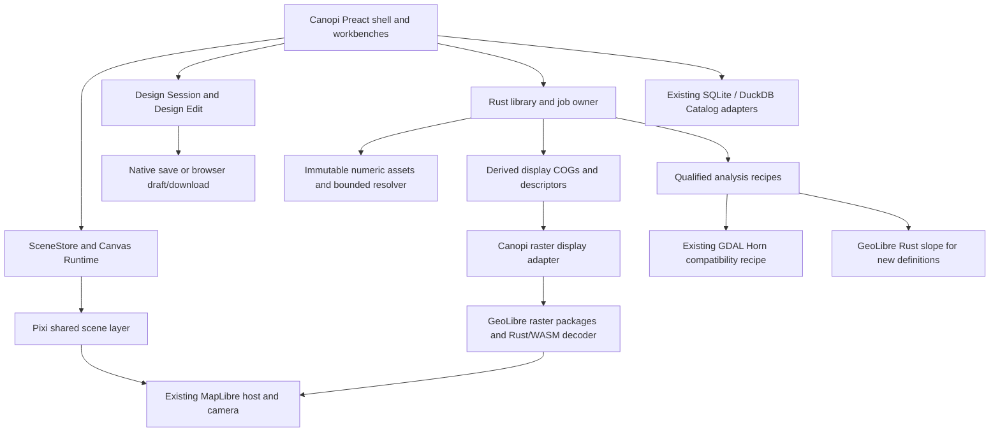

# Canopi application plan: GeoLibre reuse and a simpler Data Library

Status: active — the user assigned S0–S5 production implementation on 2026-09-24 through the [implementation prompt](geolibre-adoption-agent-prompt.md). S0–S5 are implemented on the branch and awaiting user review; delivery evidence is in the [adoption receipt](geolibre-adoption-receipt.md) and the implementer debrief in [review and debrief](review-and-debrief.md#geolibre-adoption-delivery-s0s5--2026-09-25). Current behaviour is described by the LiDAR, MapLibre, build-release and edition-development guides below; integration, release, branch cleanup, skill edits, subagents and live-library experiments remain separately authorized.
Tracking: epic `canopi-8shm` (S0 `canopi-8shm.1` … S5 `canopi-8shm.6`) on branch `feature/geolibre-adoption`. Interactive reference `canopi-2c94` is complete. Existing raster qualification remains in `canopi-j571.3` under `canopi-j571.1`; it is not silently replaced by this plan.
Current guidance: [architecture ownership](../../workflow/architecture-ownership.md), [edition development](../../agent/edition-development.md), [Canvas](../../agent/canvas-runtime.md), [MapLibre](../../agent/maplibre.md), [LiDAR](../../agent/lidar.md), [Design lifecycle](../../agent/document-lifecycle.md), [database](../../agent/database.md), and [interface contract](../../../.interface-design/system.md).

Assignment: [GeoLibre adoption implementation prompt](geolibre-adoption-agent-prompt.md), invoked by the user on 2026-09-24. User visual acceptance remains separate from implementation delivery.

## 1. Outcome and scope

Deliver a functional Canopi with a fast, searchable library of reusable terrain data and a clear way to use it in a Design. Reuse GeoLibre geographic infrastructure while retaining Canopi's botanical canvas/tools, plant database, Calendar, Budget, Consortium, persistence and exports. Keep TypeScript/Preact and Rust; add no Python implementation or tooling.

**First usable milestone: Import → find → preview → add to Design → inspect → remove → reuse in another Design.** New analysis follows that milestone. It must not delay making the library and display useful. Final whole-app completion includes contextual Slope and regression checks across the retained Canopi workflows.

The migration stays in the Canopi repository. Adopt useful upstream packages and narrow source modules; retain SceneStore, Design Edit, the MapLibre/Pixi camera composition and the native library owner. No fork of GeoLibre's React/Zustand app, second project store or database rewrite is needed. Unused functions inside an adopted dependency are acceptable; extra product screens are not a reuse objective.

### Accepted product decisions

The user accepted these decisions on 2026-09-24. They supersede this plan's earlier requirement to preserve every Data/Analysis feature and screen:

1. **Library first.** Add, search, simple type filtering, preview/details, rename, reuse across Designs and deliberate deletion. Keep progress, Cancel and Retry for real operations.
2. **Two surfaces.** Data Library manages reusable items; Layers manages the current Design's presentation. Analysis later becomes a contextual action, with no separate primary Analysis navigation.
3. **Remove dataset history and mutable composition from the target workflow.** No history browser, Restore, library Undo, append/replace/reorder/remove source controls or automatic dependency-driven analysis refresh. Preserve old data and exact composition readers; canvas and Design undo/redo remain.
4. **Use upstream display behavior.** GeoLibre overview/resampling and mosaic behavior may differ visually at low zoom. Numeric inspection, historical composition and saved results retain their exact rules (section 5).
5. **Preserve edition boundaries.** Desktop keeps local data and analysis. Web keeps its current Design, canvas, Catalog, Location and basemap capabilities, preserving unavailable local references. No browser raster import/analysis is added.
6. **GeoLibre for new Slope calculations.** Record method/version and inputs. Existing Horn results remain readable with their original meaning; retrying a failed legacy operation preserves its recipe. A new calculation creates a new result. No result updates itself when another item is imported or renamed.

Keep the existing .canopi v6 reference format and its admission rules. Use a versioned native catalogue migration for changed library policy and recipe dispatch. Compatibility preserves user data and references, not every obsolete command or version-management feature. This planning update authorizes no code changes, live-library migration, integration or release.

### Scope removed and scope deferred

| Disposition | Features | Boundary |
| --- | --- | --- |
| Remove during library cutover | Dataset history/Restore/library Undo; editing a published item's source membership/priority; standalone Analysis navigation; automatic refresh and its scheduling | Retain old assets/rows/readers only where needed for compatibility and safe recovery. Remove callable mutation/refresh paths, not merely their buttons. |
| Later in this plan | Contextual Calculate slope, units, result name, progress and saved result | New results appear as library items. Legacy results and failed-job recovery stay accessible during the first milestone. |
| Outside this plan | Advanced LiDAR processing/filter builders, point clouds, hydrology, SQL console, plugin marketplace, RGB imagery, browser raster processing | No speculative controls, general recipe editor or hidden processing framework. |
| Preserve | Canvas/Design undo, plant tools/catalog, Calendar/Budget/Consortium, Location/providers, supported exports and both editions | Validate these with the new renderer active; do not rewrite working domains. |

### Import grouping decision

**Accepted by the user on 2026-09-24: one fixed library item per import.** A submitted selection of one or several compatible TIFFs publishes one named item referencing the independent managed source assets. Reuse the existing ordered-source reader. Importing more files later creates another item; it never appends to or replaces the contents of an existing one. Shared source bytes may use existing deduplication without collapsing distinct library identities. Retrying a failed import retains its item/request identity and creates a new job, avoiding duplicate successful items.

Retain whole-batch compatibility checks for measurement, units, CRS and aligned lattice. If any selected source is incompatible or preparation fails, publish none of the batch; show the affected file and reason rather than silently splitting the selection or accepting a subset. Preserve the displayed selection order in the saved request and snapshot: the first listed valid source wins at an overlap, and NoData reveals the next valid source. Show this rule with the file list when overlap exists; no source-priority editor is added. Retry preserves the same order.

Grouping is metadata, not a request to merge pixels into a giant raster. Keep independent source assets and per-asset overviews, select viewport candidates and process analysis in bounded windows. Test adjacent tiles and distant footprints separately: empty gaps must not cause full-union allocation. File count, total processing and cache/decoder limits still require admission and measurement; a logical collection does not make size unlimited.

## 2. Inspected evidence and its limits

Research date: 2026-09-24. Application baseline: integrated Canopi `e01e7d077ed480c6fe32383018c2ffd8e929cd0c`, following candidate `1bcf8060`. The [integration receipt](completion-receipt.md#integration-for-user-review--2026-09-24) retains earlier gate evidence. The user's slow display and poor UX reports are acceptance failures; the previous test totals do not overturn them.

| Inspected source | Finding and consequence |
| --- | --- |
| [GeoLibre `68598ba4`](https://github.com/opengeos/GeoLibre/tree/68598ba40dcc295e40d5e952f3c25b0cafa644c0) | Its raster plugin defaults to `cog-tiler-wasm`, with local range-readable Tauri asset URLs. Other API routes can choose another engine. Reuse the actual route; do not infer that every upstream raster path is identical. |
| [Raster plugin](https://github.com/opengeos/GeoLibre/blob/68598ba40dcc295e40d5e952f3c25b0cafa644c0/packages/plugins/src/plugins/maplibre-raster.ts) and [Tauri file integration](https://github.com/opengeos/GeoLibre/blob/68598ba40dcc295e40d5e952f3c25b0cafa644c0/apps/geolibre-desktop/src/lib/tauri-io.ts) | Useful integration evidence for initialization, style reloads, local URLs, codecs and WebKit. Copy only fixes reproduced against the selected dependency versions. Do not copy its whole app/plugin state. |
| Published `maplibre-gl-raster@0.14.15` and `cog-tiler-wasm@0.4.0` tarballs | Public `LayerManager` supports headless control of display; the internal `CogTilerEngine` is not a public import. Tiler supports source windows, overviews and projection. Its default per-source cache is not a global memory limit, and it has no complete public cancellation/disposal surface. These are integration gates, not assumed properties. |
| Published `@geolibre/map@3.0.0` and `@geolibre/core@3.0.0` tarballs | The headless map bundle imports the core barrel. The core bundle creates `useAppStore` and subscriptions at module scope and imports Zustand. The package also declares React/other renderer dependencies. Its README's headless description is insufficient proof of application isolation. Do not import these root packages into production unchanged. |
| [Headless map API](https://github.com/opengeos/GeoLibre/blob/68598ba40dcc295e40d5e952f3c25b0cafa644c0/packages/map/src/headless.ts) | `createLayerSync` explicitly does not preserve placement relative to unmanaged layers. Canopi's Pixi scene and overlay bands therefore still need their existing stack owner. Useful independent exports/source modules can be reused separately. |
| [geolibre-rust `aac2b743`](https://github.com/opengeos/geolibre-rust/tree/aac2b743978666f3c3119b5c93de1b30963b1493) | Native `cargo check --locked -p geolibre-cli` passed on this Linux host, with a separate target directory. The Rust CLI is a viable build route without Python. No native operation, release binary, resource limit or cross-platform package was proven by that check. |
| [Native tool runner](https://github.com/opengeos/geolibre-rust/blob/aac2b743978666f3c3119b5c93de1b30963b1493/crates/geolibre-cli/src/main.rs) and [raster I/O helper](https://github.com/opengeos/geolibre-rust/blob/aac2b743978666f3c3119b5c93de1b30963b1493/crates/geolibre-tools/src/common.rs) | The runner exposes tool IDs/manifests and file-path execution. Many tools load full rasters. The browser WASI wrapper stages files in memory. Neither is an unqualified replacement for Canopi's bounded large-data jobs. |
| [Pinned Whitebox terrain implementation](https://github.com/opengeos/whitebox-wasm/blob/9c0ff4fdf3513f27b89c78e294610c3b418b3a4f/crates/wbtools_oss/src/tools/geomorphometry/basic_terrain_tools.rs) | Projected slope uses a 5×5 Florinsky calculation; its manifest text describes a different stencil. Read implementation and verify numeric results instead of generating Canopi's scientific contract from descriptions. Existing Canopi uses GDAL Horn with a one-cell halo. |
| Canopi `prepared_raster.rs`, `tiles.rs`, `raster_assets.rs` | Prepared numeric COGs deliberately have no overviews and one uncompressed base level. Non-Mercator display requests can transform a 257×257 lattice in 4096-point GDAL batches. These explain substantial avoidable work; a complete latency attribution still needs the benchmark below. |
| Live existing UI gallery | On the baseline, Desktop `?surface=workspace` throws `missing surfaces: data, analysis`; Web throws `missing surfaces: location`. Reproduced with the actual gallery on a spare port. Typechecking the gallery did not establish that either workspace mounted. Repair these fixtures before relying on them for UI review. This does not establish that the production app has the same registration failure. |

The pinned native Whitebox revision is already used by Canopi's `wbgeotiff` dependency. Reuse has begun; the missing piece is using an appropriate complete display path and qualifying its composition with the application. This research did not measure a migrated Canopi renderer, verify packaged WASM, or certify all GeoLibre capabilities as suitable for Canopi.

Research scratch trees and logs under `/tmp` are disposable. Reproduce the source/artifact inspection from the revisions above; do not make temporary paths build or test dependencies. Initial offline native checking failed because a dependency was not cached; the subsequent network-enabled locked check succeeded. Record the successful compilation separately from runtime evidence.

## 3. Whole-application feature and reuse map

Each row is a delivery obligation. “Keep” means preserve and test it in the combined app, not leave it out of the plan.

| Canopi capability | Implementation decision / upstream reuse | Completion proof |
| --- | --- | --- |
| App startup, Welcome, New/Open, Recent Designs, Notebook, dirty close guard | Keep the Canopi shell, command graph, session and Notebook. Do not adopt GeoLibre project serialization or startup store. | Create/open/switch/cancel a dirty replacement, recover an autosave, reopen from Notebook; startup works with maps unavailable. |
| Canvas navigation and rendering | Keep MapLibre camera authority, shared Pixi custom layer, local-metre frame and Canvas2D fallback. Reuse the same MapLibre engine/version used by the adopted stack. | Pan/zoom 0–27, Return, resize, rendering failure/fallback and restoration; no duplicate camera or render loop. |
| Canvas tools and editing | Keep plants, all Zone forms, annotations, groups, selection, locks, guides, grid/snap/ruler, stamps, undo/redo and command shortcuts in SceneStore/runtime. GeoLibre vector editing does not replace these semantics. | Existing command/tool suites plus a driven edit/undo/save/reopen journey over an active raster. |
| Plant appearance and identification | Keep Species Key/codes, focus, symbols/colors, detail policies, hover/selection and Target overlays. | Colors/symbols, codes and locks survive migration; map interactions do not consume canvas gestures or obscure overlays. |
| Species Catalog, filters, details, Favorites and placement | Keep authored catalog contracts and full Desktop/reduced Web readers. GeoLibre's DuckDB GIS tables are not the botanical catalog. | Search and filter in multiple languages, detail/favorite/place, stale search cancellation and browser artifact admission. |
| Calendar, Budget, Consortium | Keep planning projections, civil-date rules, Design Edit, dock state and exports. There is no useful GeoLibre replacement for these product rules. | Editing a plant or plan updates relevant projections; switching Designs clears session view state correctly; exports and dirty state remain correct. |
| Location, coordinates, Desktop search and template world map | Keep workbench transactions, placement confirmation and provider policy. Reuse upstream coordinate/extent utilities only where they replace existing generic work with equivalent behavior. | Provisional/confirmed placement, bearing, undo, wrap/world copies, Desktop search, browser-safe Location, template preview/import. |
| Basemaps, hillshade and contours | Keep existing provider credentials/attribution lifecycle and `maplibre-contour`, already a standard library. Reuse upstream MapLibre/COG terrain helpers only for an actual accepted caller; local DEM terrain is not added just because a helper exists. | Provider failure/withdrawal, credit, hide/show, style reload, contour/hillshade controls; no key in saved state/logs. |
| Data import and library management | Keep stable identities, managed originals, numeric readers and safe publication. Replace mutable collections/history with fixed published items. Reuse upstream metadata/range transport and display preparation. | Import/cancel/retry; search/filter/preview/rename; reuse across Designs; explicit delete; no source editing or history UI; old data still opens. |
| Raster display and inspection | Replace Canopi's expensive native PNG tile route with the upstream renderer and display COGs. Keep native exact numeric inspection and head fences. | Actual map first-paint/pan metrics, native range reads, correct layer bands, NoData/units, latest-only inspection and offline use. |
| Analysis and result management | Later, selected input → Calculate slope → new reusable result. Retain eligibility, owned jobs, cancellation, failed-job Retry and publication. GeoLibre for new calculations; saved recipe for Retry; no automatic refresh. | UI → action → IPC → native operation → library result → map → inspection; a second calculation leaves the first result unchanged; old Horn results remain readable. |
| Data Library and Layers UX | One library list for inputs/results; one current-Design presentation list. Use upstream style metadata behind existing Canopi controls. | Library search/type filter; Add/Added; independent visibility/order; selected opacity/legend/Fit/Inspect; Remove leaves the reusable item intact. |
| Design persistence and interoperability | Keep `.canopi` v6, extra-field preservation, Scene/document ownership, atomic native saves and browser drafts/downloads. Runtime URLs and upstream objects never enter the Design. | Native/Web conformance corpus, dirty/save races, unknown fields, cross-edition roundtrip with unavailable local references preserved. |
| Canvas PDF, image export, Budget export and saved stamps | Keep existing export authorities and capabilities. GeoLibre map capture cannot replace a botanical field-sheet exporter. PDF backgrounds remain deferred under ADR 0024. | Preview/cancel/deliver/reopen exported artifacts; no dirty-state acknowledgement or scene mutation from export. |
| Themes, 11 languages, keyboard/pointer accessibility, responsive dock | Keep Preact, CSS Modules, shared controls and i18next. Reuse upstream interaction ideas and pure models, not its React component hierarchy/CSS framework. | Real long translations, narrow/short windows, light/dark, focus return, Escape, keyboard input and persistent actions. |
| Settings, diagnostics, updates/build/release and edition boundaries | Keep current platform adapters, credential boundaries and Problem Reports. Add packaged upstream assets and licenses through existing build/release tooling. | Clean install/offline start, privacy-safe diagnostics, both builds, native package smoke and platform matrix. |

Inventory production command registrations and existing entry points in S0. Classify each as retained, intentionally removed under section 1, or deferred. An unlisted botanical/Design capability remains preserved. Remove superseded commands and tests only against the explicit scope change, retaining their still-relevant safety assertions.

## 4. Architecture and code reuse decisions

### Dependency disposition

| Source | Decision |
| --- | --- |
| `maplibre-gl-raster@0.14.15`, `cog-tiler-wasm@0.4.0` | Adopt the public vanilla `LayerManager`, explicitly selecting WASM, behind one Canopi display adapter. Validate actual npm declarations and production bundling in S1. Do not deep-import the private engine or use the React entry. |
| MapLibre / `geotiff` / `proj4` | Start the proof at upstream's inspected MapLibre 6.10.0, GeoTIFF 3.0.5, proj4 2.22.0; pin the successfully qualified set and deduplicate MapLibre. Upgrade and test the Pixi custom layer together. Avoid floating dependency changes during acceptance. |
| `whitebox-wasm` and `wbgeotiff` | Preserve the native pin unless a required, tested change warrants updating it. Bundle the exact WASM/codecs selected by the tiler. Native and browser use of related source does not by itself prove identical precision or NoData behavior. |
| `@geolibre/map` / `@geolibre/core` | Do not use their current barrels as Canopi application infrastructure. For an independent useful function, prefer its existing underlying library; otherwise vendor the narrow source module and necessary pure dependencies with provenance. Examples include COG metadata/coordinate helpers; no unused utility collection. A future upstream pure entry may replace that vendor copy after verification. |
| GeoLibre app source | Adapt the proven local asset URL/initialization patterns, relevant codec fixes and useful parameter/metadata presentation models. Replace only environment hooks with Canopi adapters. Retain upstream attribution/license and tests where applicable. Do not pull in its plugin host, project store, Python service or scripting system. |
| `geolibre-rust` native tools | Adopt the pinned native CLI for new Slope definitions, as a job-owned child process with argv, job scratch paths, bounded inputs, kill/reap and validated outputs. Build and package the binary per platform; the all-tools registry may remain compiled while Canopi exposes only its qualified recipe. Existing Horn definitions retain GDAL. No Python/WASI virtual-filesystem detour on Desktop. |
| GeoLibre DuckDB/SQL machinery | Keep current catalog readers. No SQLite → DuckDB migration or SQL console is necessary for the retained Canopi application. Reuse a spatial SQL package only when a separately authorized geographic query requires it. |

A native GeoLibre recipe must declare its tool/version, mathematical method, units, supported CRS, NoData/quality policy, whole-input versus windowed execution and tested resource envelope. Whole-raster tools cannot be made correct merely by cutting arbitrary chunks. Neighborhood tools need their actual halo; global hydrology needs a separately designed algorithm boundary. These rules prevent the next cycle of “all tests green” with different scientific meaning.

### Boundaries to keep small

- Extend the existing `maplibre/` and `app/canvas-map-surface/` seams. One adapter owns the upstream manager per live map; no general GIS facade, renderer framework, second map or app-wide event bus.
- `app/lidar/` keeps action/workflow/library-read ownership. Components consume read models and call actions; they do not manage assets, engine objects or publication transactions.
- Rust `services/lidar/` owns immutable numeric generations, derived display artifacts, bounded I/O, jobs and recovery. `commands/lidar.rs` stays executor-backed. No raster work in synchronous commands.
- SceneStore and Design Edit retain their existing split. GeoLibre objects are disposable render/compute objects, never an additional authority for Design data, dirty state or history.
- Keep stable public `lidar_*` identities during migration. Do not rename the entire subsystem to `geo` while changing behavior. Internal module names can describe display preparation and adapters without a broad move-only rewrite.

### Reuse maintenance contract

For each vendored/patched module, keep one provenance record: upstream repository, exact commit/package version, original paths, license, local changes, why an unchanged package cannot serve the caller, and tests covering the change. Prefer package imports; use source reuse where the published boundary is coupled. Keep notices in the shipped third-party notices. No permanent application fork or automatic upstream syncing.

Permitted initial downstream changes are narrowly limited to the adopted renderer boundary: correct declaration defects, expose a worker-compatible render/close hook, honor bounded resource/cancellation settings, and surface incomplete mosaic/errors. Do not copy a replacement decoder, warp algorithm, pyramid selector, colorizer or mosaic compositor into Canopi. If adoption needs a wider engine rewrite, stop that slice with the failing production proof and a revised recommendation; proceed with independent UI/parity work.

## 5. Geographic data, rendering and scientific contracts

### Numeric authority and display artifacts

Keep the existing controlled Float32 numeric profile and reader contract. It requires one base level; simply enabling overviews in that file would break it. Add a separate, versioned **display derivative** profile: tiled COG, lossless compression supported by the pinned decoder, and valid-data overviews down to a small overview. Start with DEFLATE and 256-pixel blocks to minimize codec differences. Keep native CRS; use upstream display reprojection.

Create derivatives from managed immutable assets, keyed by asset content identity plus display-profile version and any required unit transformation. A derivative is regenerable display data, never a new source member, a source head, or an analysis result. Source originals and exact numeric generations remain intact. Existing valid derivatives are reused across Designs and detach/reattach.

New import stages its required display assets under the same job before final publication. Failure/cancellation before publication leaves the old head and no partial successful import. Existing libraries receive lazy, recoverable derivative preparation for visible assets; the UI distinguishes preparing display from missing scientific data. Do not force a full-library rewrite at startup. Numeric inspection and saved results remain available independently.

Previous-composition members retain their exact historical numeric resolver. For their display, use existing occupied numeric chunks or bounded windows to create sparse display COG parts. Never reinterpret an old masked merge as a new source-priority list. Empty geographic gaps do not become dense allocation or a mandatory full-union COG.

### Explicit display amendment

Under the user-accepted display decision in section 1, native-cell topmost-valid composition remains authoritative for numeric reads and analysis. Display uses upstream per-source overviews, the saved source priority and transparent NoData. It uses one layer-wide stretch, units and legend, not a different automatic scale per member. At low zoom this is a visualization of the collection, not its exact reduced numeric grid. This is the accepted migration target, not a claim that the current renderer has changed.

Example proving the distinction: upper source `[100, NoData]`, lower source `[0, 0]`. Exact composed-cell mean is `50`; independently reduced upper-source display can show `100` over that footprint. The implementation must preserve numeric inspection and analysis while testing/recording this allowed visual difference. This is why adopting a stock mosaic is an explicit amendment of [ADR 0002](../../adr/0002-geolibre-module-reuse.md) and the [ordered composition contract](ordered-cog-design.md), not a claim of pixel equivalence.

ADR 0027 and the ordered composition contract now record this accepted display amendment. During implementation, migrate old exact-display tests to the accepted behavior while preserving numeric cases, exact historical priority/validity and saved-result meaning. History UI and mutation tests are superseded by the fixed-item contract; compatibility reads are not. Do not quietly delete the tests to get the package green.

Preserve quantity meaning: `Percent` slope is not passed to a degree-colored renderer as though it were degrees. Use the upstream style in the actual stored units with a matching legend; a degree-based display requires an explicitly keyed derived conversion. Existing custom ramps may be mapped to a documented upstream palette with the updated legend under the display amendment; do not claim the old ramp is retained if the public WASM API cannot express it. No physical values are obtained by reading colored map pixels.

### Display descriptor and asset boundary

Extend authored Rust/TypeScript IPC contracts, then regenerate bindings. Add a request for a display descriptor by entity ID and expected immutable generation. Its response describes `preparing`, `ready`, `unavailable` or `failed`, includes generation/profile identity, geographic bounds, band/units/range, and the ordered immutable COG/mosaic resource reference. Error and preparation identity must be distinguishable from a numeric job's state. A head mismatch is typed stale and causes a fresh read, not publication into the replacement Design.

The backend resolves identifiers to managed files. Scope only published display assets/manifests through Tauri's asset protocol; adapt GeoLibre's range-readable local URL path. No arbitrary path command, broad home-directory scope or whole-file byte IPC. Validate real partial responses/range behavior on the WebView, not just a mocked URL. Handle spaces/non-ASCII filenames and missing/truncated files. Runtime asset grants/URLs do not enter `.canopi`, logs or shared diagnostics.

Display readers hold asset leases until settled. Removing a layer releases its manager/worker references; deleting library data cannot unlink a file still used by an admitted read. Stale capabilities must not resolve to newer data under the same URL. Cache keys include immutable generation, display profile, style and tile coordinates as appropriate.

### Map and worker ownership

Use `LayerManager`'s public add/update/visibility/order/remove/destroy capabilities. Apply Canopi's semantic band order around its managed layer IDs: basemap → raster → geographic reference → botanical scene → interaction overlays. A style reload restores all contributions; no source may survive without its owner. Opacity changes are paint changes; camera/style actions never start analysis.

Raster decoding/reprojection runs off the UI thread. First prove the manager's public loader seam against a small module-worker adapter using the tiler's actual API; patch the upstream boundary only within section 4's permitted scope if a synchronous helper prevents this. This is transport/ownership glue, not another tiler. Keep metadata/statistics in that same resource lifetime. Bundle workers/WASM/codecs locally for Desktop; explicitly configure offline CRS definitions from admitted dataset metadata rather than relying on an `epsg.io` lookup at first render.

Map-lifetime teardown terminates workers, removes manager layers/listeners, releases asset leases and settles pending calls. Each request carries its map/installation generation; late success, error and finally cannot affect a successor. Reuse the existing F1/F2 lifecycle regressions and actual Surface Adapter. No recreated global installed boolean.

### Resource and failure behavior

Start with two raster worker lanes per active workspace and one preparation lane under the existing job owner. Foreground visible tiles outrank obsolete work and speculative statistics. Cancel obsolete requests, drop queued work for retired generations, and release completed buffers. Tune concurrency only from measurements, not one worker per COG.

Use one aggregate decoded-block cache budget, initially the current 128 MiB raster-cache budget, across active display sources. A per-source 256-block cache does not satisfy this. Carry forward the 512 MiB disposable tile-cache budget if that cache remains; account for display derivatives separately as durable/rebuildable disk use with capacity admission. Do not mislabel live worker/WASM memory, current render windows or file pages as cache bytes. Measure aggregate app + WebView + worker/child peak separately.

The initial budget is a configuration target to prove, not a reason to silently reject currently admitted imports. Preserve the existing admission ceilings until representative evidence authorizes a change. New disk estimates include overviews, concurrent scratch and retained previous publication; recheck capacity during writes. Failure preserves prior published assets and a retryable state.

The stock mosaic path limits one tile to 512 assets and its manifest parser has a 10,000-asset guard. It can skip failed members. Do not ship a console-only truncated collection as a successful complete view. Test the current admitted collection envelope, multiple imports and sparse previous-composition chunks. Where those guards intersect supported input, adjust the upstream path to process candidates in bounded batches or report an explicit unsupported view pending repair; full acceptance requires retaining the supported view. Do not fix it by building a dense union or raising every memory limit. Recoverable tile failures may leave other visible data usable, but expose the incomplete layer state and retry.

### Analysis methods, persistence and execution

Use the existing `lidar_analysis_definitions.version` column as the recipe discriminator for `kind = slope`: **version 1 is legacy GDAL Horn; version 2 is the pinned GeoLibre projected slope**. Carry that discriminator through `AnalysisDefinitionRow`, catalogue reads, explicit job submissions and execution; current readers omit it. Automatic refresh is removed under the library cutover. New Create writes version 2 only after the runner has passed qualification. Retry of a failed/cancelled operation loads the stored version, never the current Create default. A new calculation creates a new definition/result and does not update a ready one. Unknown kind/version or malformed parameters fail explicitly with the previous result preserved; remove `run_refresh`'s current parse-error fallback to default parameters.

Keep `slope_unit` and name in the existing parameters JSON. Record method ID (`gdal-horn-v1` or `geolibre-projected-slope-v1`), recipe version, actual engine/build revision and input-generation identity in each newly published result's provenance. Expose typed method/provenance in generated summary/inspection contracts so the UI can label results without parsing debug text. Existing results identify as legacy Horn; unknown historical engine build stays unknown rather than being invented. The kind/version mapping is the execution authority; provenance records what actually ran. Recipe version is distinct from Design format and asset-manifest format. Do not change the mapping's mathematical meaning on an upstream upgrade: a changed method needs a new recipe version.

Bump the library catalogue schema using its existing SQLite-consistent backup/migration mechanism. Existing definitions stay version 1 with the same IDs, parameters, heads and files. Validate unexpected existing versions rather than coercing them. The schema bump is necessary even if the discriminator column already exists: the old binary ignores that column when dispatching, so it must refuse the newer catalogue instead of executing version 2 as Horn. Keep `.canopi` v6 references unchanged. Rollback uses the migration backup in an isolated library/profile and retains newer results/assets for recovery; do not promise that an old binary can open the migrated catalogue.

For version 1, keep the exact resolver, current projected-metre eligibility, full-resolution numeric input, one-cell Horn halo, degree/percent results and existing validity/quality masks. For version 2, use the same eligible composed input grid and units, with the inspected **5×5 projected Florinsky stencil and two-cell halo**. Stage each 1024×1024 core plus its 1028×1028 input window; make resolver/reader halo admission recipe-specific and recheck the existing live-byte budget. No whole-dataset materialization. Run the real `geolibre slope --input=… --output=… --units=degrees|percent --z_factor=1` command and crop only the halo. Do not reimplement its gradient formula in production or select the geographic variant for an ineligible input.

Define the new method's missing-data policy explicitly: invalid centre means invalid output; the pinned upstream method substitutes the valid centre for missing neighbours; quality is 1 only where every cell of the 5×5 input neighbourhood was originally valid, otherwise 0. This new two-cell quality margin is method-specific; it does not rewrite legacy Horn quality or reopen the separate frozen Q investigation. Keep original validity separately from staging samples. The inspected 5×5 code compares neighbour NoData by equality, so NaN staging does not implement that substitution. Choose a finite negative Float32 sentinel absent from the bounded window's valid samples, encode it with a round-trip-safe NoData tag, and test the actual reader/writer roundtrip; never assume `-9999`, zero or a valid negative elevation is unused. Exclude invalid centres, nonfinite outputs and the sentinel before publishing canonical result chunks. Stored originals remain unchanged.

Build the native CLI from pinned `geolibre-rust` and its locked Whitebox revision. One job-owned child processes one admitted window at a time; start with `RAYON_NUM_THREADS=2`, bounded stdout/stderr and the existing finite chunk-process deadline. Extend existing process lifecycle code only as needed for the second executable. The existing native executor admits work; no new scheduler or in-process uninterruptible call to a whole-raster algorithm. Cancel/timeout kills and reaps the child, and never publishes its partial output. Aggregate progress by completed windows because the inspected slope tool reports completion at the end of a window; do not invent smooth internal progress. Prove actual execution, packaged binary resolution, cancellation, memory and numerical behavior beyond the research compile check.

R50 Retry submits the failed operation's stored definition and expected input generation, never current form fields. Pin that input on job creation; if a legacy failed job has no unambiguous input, refuse Retry with a useful explanation and offer a new calculation. An input/head mismatch cannot silently retarget the operation. Jobs survive panel changes; cancellation is explicit; an existing complete result is never overwritten by retrying a failed attempt. A ready result offers a new calculation through its input, not in-place Run again. Enforce that refusal in the native command too, including a legacy failed refresh with a retained complete result. Analysis publication rechecks source, saved recipe version and definition identity inside the transaction. Expose operation/method-specific availability through the library read model rather than treating the current single GDAL availability boolean as proof that both methods can run. A missing GeoLibre binary makes new analysis unavailable with a useful error; it never falls back to Horn. A missing legacy GDAL capability likewise cannot silently move an old definition to GeoLibre. Already prepared display and saved numeric results remain readable independently of engine availability.

R48 mid-write preservation/retry and R51 in-flight Value/NoData head-change proofs remain acceptance tests. Imported surface elevation/height/unknown-unit data must not become ground-elevation inputs because an upstream manifest only says “raster.” The Canopi semantic eligibility check precedes tool execution.

Inspection stays on the native numeric API and reports units, validity, quality and current generation. Panel selection/Design replacement cancels presentation intent; native checks still guard every result exit. No user source reorder/history operation remains in the target product. Importing or renaming another item does not invalidate this item or enqueue analysis. Keep native generation/existence fences for deletion, interruption and stale clients.

## 6. User experience across the application

Retain the canvas-first shell, one resizable side dock and Canopi's parchment/ink/ochre tokens. Data Library and Layers are the only data-management surfaces. Opening either keeps the canvas mounted; selection in a list does not change plant selection, visibility or the active scene drawing layer. Reuse DockPanelHeader, SurfaceSearch and ActionMenu rather than copying GeoLibre's component hierarchy.

### Data Library: find and reuse

The header has **Import**. Beneath it are search and a simple type filter (All, source measurements, Slope); no advanced query builder or extra status-filter bar. Search matches the item name; import defaults the name from the selected file/batch, so it is findable immediately. Search/filter/sort and detail navigation are session view state, not .canopi data. Keep a stable name order with identity as the tie-breaker; show an operation started here in a compact progress row even if the active filter excludes its eventual item.

Use compact ruled rows: a small preview, readable name, quiet type/resolution or units, then **Add to Design**. Already attached items show **Added**; hiding one in Layers does not make it unadded. Add is idempotent and preserves an existing reference's visibility/opacity/order. A preview loads lazily through the upstream rendering boundary; a missing preview does not block search or metadata. The library dock owns preview requests and their cancellation; they use the same bounded raster resources, not a MapLibre instance/worker per row or another native colorizer. Do not read full rasters merely to populate rows.

Clicking the name/preview opens details in the same dock. Back restores search, scroll and initiating focus. Details show a larger preview, extent, measurement/units, resolution, availability and source filenames; result details also show input and method provenance. Technical CRS/engine facts belong in a disclosure. Rename and Delete live in the overflow menu. Names need not be globally unique; identity never comes from a name. Do not add a second list of results under every source.

### Import: choose files, supply only missing meaning, finish

Open the native picker before creating anything. Cancelling it creates no item/job and does not dirty the Design. Read metadata, suggest an editable name, and ask only for interpretation required to use the samples correctly. Ground elevation versus surface/height cannot be guessed from a filename; unknown semantics remain explicitly unknown and ineligible for Slope. Unsupported/incompatible input is explained beside the relevant file before publication.

Import saves to the library. It does **not** implicitly attach to a Design or move its camera: the visible Add to Design action is the single attachment step. After success reveal the new item while preserving the user's search state for Back. A multi-file selection produces one item under the accepted grouping contract in section 1; source filenames remain available in details. No empty-dataset setup, existing-destination picker, before/after comparison, source-priority editor or separate Apply stage.

Progress and errors appear beside the affected operation, with Cancel/Retry. Closing the dock or changing Design leaves library work running; only explicit Cancel cancels it. A failed import remains an honest failed operation, never a Ready empty dataset. Retry uses the saved request and new job identity; a missing original file requires choosing it again and revalidating it. Dismissing a never-published failed/cancelled item removes only that operation's unreferenced staging/metadata. Late completion cannot reinsert a dismissed item or attach into another Design.

### Layers: use data in this Design

Keep existing botanical/geographic bands. Within the data band use flat rows in actual drawing order, independent eyes, readable names and compact unavailable/preparing/error state. Source/result nesting must not constrain drawing order. Use the existing keyboard-accessible order controls; order here affects display only, never source composition or science.

The selected row exposes opacity, an honest units/legend scale, Fit, Inspect and Remove from Design. Fit/Return changes only the shared camera. Inspect samples native numeric data, retains pan/zoom, offers a keyboard centre sample and exits on Escape, hiding/removing the target, Design replacement or map teardown. Displayed colors are not numeric measurements.

Remove from Design leaves the library item and other Designs intact and remains undoable through Design Edit. Adding marks the current Design dirty and creates one visible reference at the top of the data band; it does not auto-Fit. Unavailable local references remain visible and saved with their existing presentation settings. Management actions link to Data Library details instead of duplicating them in Layers.

### Contextual analysis, after the library milestone

An eligible source's menu/details offers **Calculate slope**. The same action may be reached from its Layers details. It opens a small dock form with fixed selected input, editable suggested result name and Degrees/Percent; the primary action is Run. With one operation, no algorithm picker is needed. Put the precise GeoLibre method in details rather than the main form. Show an eligibility reason for unsupported measurement/grid/units or a missing engine; never choose another method silently.

Run creates a separate library item. If invoked from Layers, attach the successful result only to that same originating Design session; otherwise leave it in the library with Add to Design. Switching Designs during execution cannot attach to the replacement. A second calculation creates a second result even with identical parameters. Inputs and earlier results stay unchanged.

Failed/cancelled operations expose Retry using their saved input/method/parameters; this is distinct from making a new calculation. Existing Horn results show their method in details and stay readable. There is no History, refresh action, dependency-status dashboard, standalone Analysis panel or advanced LiDAR filter builder.

### Visual and interaction acceptance

Keep the canvas visible, compact borders and useful density. Avoid nested cards, repeated headings, long instructional paragraphs and technical generation/job identifiers in the main flow. Use 400/600 weights and shared spacing/focus tokens; green remains reserved for plants. All new strings use the existing 11-language system.

Search has a clear action and labelled input; filters, Add, eyes, order, menus and inspection work by keyboard. Focus returns to the initiating row/control after Back or dismissal, with a sensible fallback if it disappeared. Escape exits inspection or dismisses an unsubmitted form/menu; it never cancels running work. On narrow/short windows, controls remain reachable in the existing responsive dock and action footer. Exercise light/dark, long names/translations, empty, importing, failed, missing and ready states.

Use the delivered reference below for **Import → find → preview → add → inspect → remove → reuse in another Design** before backend expansion. Drive transitions as well as reviewing layout. Do not rebuild a competing reference or treat its fixture behavior as native or renderer proof.

### Interactive reference and implementation handoff

The user authorized this gallery-only reference on 2026-09-24. Entry: [library-reference.html](../../../desktop/web/ui-gallery/library-reference.html), served by the existing `npm run dev:ui` command from `desktop/web/`. Open `http://127.0.0.1:1422/library-reference.html`; a separately chosen strict port works too. Add `?state=empty|ready|importing|failed|unavailable|long&theme=dark` for deterministic review states. The default theme is light.

[LibraryReference.tsx](../../../desktop/web/ui-gallery/library-reference/LibraryReference.tsx) reuses the production SurfaceHeader, SurfaceSearch and ActionMenu with CSS tokens. Its independent entry keeps the reference out of production bundles and avoids changing current shell commands. The existing Desktop/Web gallery registration drift is repaired; both production workspace compositions mount again with their existing capabilities. The new reference has its own illustrative SVG Design view, not a second production canvas/runtime.

Use the sample picker to select multiple TIFF names; submit one named import. **Complete import** and **Fail import** in the clearly separated review strip drive the simulated job. They are fixture controls, not proposed product controls. Switch the sample Design during work, then verify the item stays in the shared library. Add/Added, details/Back, name/type search, rename/delete, independent eyes/order/opacity, Fit/Return, zoom, Inspect/centre sample, Remove and reuse are interactive. Source deletion with a saved result is refused. Closing the dock and Escape do not cancel background work.

The reference owns disposable in-memory state in [model.ts](../../../desktop/web/ui-gallery/library-reference/model.ts). It reads no selected file, creates no native job, performs no raster decoding or analysis, and saves no Design/library/settings data. Terrain thumbnails, coverage, the botanical scene and inspection values are illustrative. Fit/zoom are schematic; map panning, real canvas tools, dock resizing, Design undo, native dialogs/persistence, 11-language translation and new Slope execution require production verification. Reference copy is English; long-name and dark/narrow fixtures test layout without claiming translation coverage. Reload resets all reference state.

The implementer should reuse the shared controls and accepted interaction layout, then bind production library/actions, Design Edit, native inspection and the upstream renderer at their real boundaries. Do not promote the fixture model, synthetic numbers or SVG terrain into product implementation. Preserve the production ownership and safety rules in sections 4–7.

Verification entry points: [model behavior tests](../../../desktop/web/src/__tests__/library-reference.test.ts), [real-component interaction tests](../../../desktop/web/src/__tests__/library-reference-ui.test.tsx), and [browser smoke function](../../../desktop/web/ui-gallery/library-reference/browser-smoke.mjs). The last is a callable Playwright `page` function for an existing browser runner: navigate to the local gallery, then run that function (the browser tool can load its absolute filename). It checks both existing edition registrations, the import/reuse journey, focus restoration and all six narrow/dark states without installing a new runner. It throws on a failed assertion or page error. A passing gallery check proves reference behavior only.

## 7. Migration, compatibility and deletion

> **Superseded for migration (2026-09-25).** The user chose a breaking Canopi v2: older LiDAR libraries are deleted on first open and v2 keeps no migration, historical reader or Horn recipe. See [ADR 0002](../../adr/0002-geolibre-module-reuse.md). The cutover steps below that preserve old data are historical; the fixed-item, recovery and deletion rules still apply.

### Fixed items with existing storage

Use the current source-layer and analysis-definition identities as library item identities. Present them through one read model; do not introduce a second catalogue, generic asset graph or new Design reference format. A published source item's content/interpretation is fixed; its name is editable metadata. A published result keeps the input generation, method, parameters and values that produced it. Add more data or recalculate by creating another item.

The existing native generation/member tables can represent a fixed item without a storage rewrite. Retain generations needed by an admitted read, an existing result or a preserved legacy composition. Historical rows/assets may remain for compatibility; that does not require a history service, version browser or new history writes. Display derivatives are rebuildable artifacts, not library items. Keep existing durability, deduplication, bounded reads and leases.

### Cutover and recovery

1. Use a copied library with ordered and masked legacy compositions, existing history, ready/failed Horn analyses and a v6 Design with local references. Record exact samples, result files and identities before migration. Never experiment on the user's live library.
2. Upgrade the native catalogue through the existing consistent-backup/version-refusal mechanism. Freeze each source at its last committed head; preserve existing IDs, originals, exact composition, result heads and method provenance. An older binary must refuse the new schema because it could otherwise mutate sources or dispatch the wrong recipe. No eager raster rewrite or deletion of historical assets.
3. Reconcile interrupted jobs before enabling new writes. Preserve durable commits; mark unpublished work interrupted with explicit Retry/Discard. Disable automatic startup/import/restore-driven analysis enqueueing. Retire pending/failed automatic refresh attempts that already have a complete result, preserving that result and its provenance; they do not expose an in-place Retry. A failed initial analysis without a result can retain explicit Retry under section 5. No calculation runs merely because the app reopened or an item was renamed/attached.
4. Remove public source append/reorder/remove/restore/undo actions during cutover, and retire their auto-refresh scheduler paths. The new native API refuses mutation of an already published source even if a stale caller invokes it; hiding UI buttons is insufficient. Keep general job admission, cancellation, safe publication, retry and late-result fences. Internal generation changes needed to finish the first publication remain allowed.
5. Prepare display derivatives lazily for existing visible items and before successful new import publication. Preparation is idempotent and separate from scientific state. It never marks a Design dirty. Missing/corrupt display artifacts can be rebuilt without recalculating a result.
6. During S1–S2 use one internal development switch with exactly one renderer per logical layer. Before the first library milestone, make the new renderer default and remove the switch and obsolete display-only code after proving no retained caller needs them. Keep exact numeric and legacy readers, not a permanent second general renderer.
7. S4 adds recipe-version dispatch and the GeoLibre executable through the same migration mechanism if not already present. Existing definitions stay Horn; new ones become GeoLibre only after qualification. Preserve .canopi v6 and all retained domain data. Rollback uses a compatible catalogue backup in an isolated profile, keeping post-upgrade assets available for recovery; do not open the newer catalogue with an old binary.

### Deliberate deletion

Remove from Design and Delete from library are separate commands. Library deletion requires confirmation with the item's name and the known current-Design impact, plus a short notice that other saved Designs can contain references. Do not scan all saved Designs or imply a complete reference count. Deletion has no library Undo; stale references in unopened Designs remain unavailable references rather than silently disappearing.

For a source with saved analysis definitions/results, refuse deletion and show the dependent count and a route to those items. Delete those items explicitly first. This is a narrow native guard replacing the current cascading delete; it protects stable results without creating an orphan-result storage model. Recheck dependencies inside the delete transaction. Jobs must settle and admitted readers release leases before owned files are removed; concurrent analysis creation/deletion must not create dangling rows or partial publication. Shared original assets are not deleted just because one reference was removed.

Deleting an item removes its current-session Design reference through Design Edit only while that session remains current. Undo can restore the reference, but cannot restore deleted library bytes; it then honestly appears unavailable. Preserve this distinction in confirmation copy and tests. There is no new garbage collector, trash browser or history-retention product in this plan.

## 8. Execution sequence and concrete exits

After authorization, bd owns implementation claims, dependencies and state. **S0–S3 deliver the first usable library/display milestone. S4 adds contextual analysis; S5 closes whole-app and platform qualification.** Do not make a new analysis engine a prerequisite for searching, viewing and reusing data. Each slice retains a runnable application, and routine green milestones require no further permission.

| Slice | Work and main ownership | Observable exit |
| --- | --- | --- |
| **S0 — Baseline and workflow reference** | Reuse the delivered interactive reference and repaired gallery registrations above. Review the target UX; inventory commands against section 1 and record actual Canopi/upstream timing on the same input. No runtime library migration yet. | The reference and both gallery compositions have been driven. Remaining S0 evidence is user visual review, retained production workflow inventory and real performance baseline; mockup timings do not complete S0. |
| **S1 — Real upstream display** | Qualify pinned npm artifacts, MapLibre/Pixi, one real COG derivative, Tauri range transport, worker teardown, offline CRS/assets and style reload through production map callers. Own maplibre, canvas-map-surface, descriptor adapter and bundling. Native Slope adoption is outside this slice. | Existing Design + editable plants + projected COG runs in the actual Desktop WebView; pan/edit while decoding, dispose/reinstall mid-read, reload style. No main-thread heavy decode, native PNG process churn, extra app store or unexpected network. Continue automatically on success. |
| **S2 — Fixed reusable library and migration** | Implement section 7 using existing tables/readers/jobs; derivatives, descriptors, source immutability, legacy result access, deletion guard, cache/capacity/recovery. Retire mutation/automatic-refresh entry points. Own services/lidar and authored/generated contracts. | Copied legacy library opens with identical IDs/samples/results; no spontaneous compute. New import/cancel/retry, sparse legacy composition, mid-write fault, interrupted restart, deletion and older-binary refusal pass real native tests. Display/resource evidence covers representative data. |
| **S3 — Usable library and Layers** | Wire section 6's two production surfaces to real actions/read models; remove primary Analysis/history/source editors; batch translation changes; keep existing failed-operation recovery and old results. Remove obsolete display switch/code after proof. | Complete the first milestone on Desktop: import, search, preview, Add, Fit/Inspect, Remove, reuse in another Design, save/reopen. Plant editing and planning remain usable during rendering. Applicable frontend/native/binding/build gates pass; actual user timings are reported. New analysis creation is intentionally deferred to S4, not claimed complete. |
| **S4 — Contextual GeoLibre Slope** | First run the pinned CLI through the actual process boundary on a small nonplanar fixture. Then implement the versioned scientific contract, simple form and reusable result publication. Preserve failed legacy-job Retry without automatic refresh. Own analysis/process/package adapters and contextual UI. | Independent numeric/NoData/seam/quality checks, actual command/publication/inspection, cancellation/reap, missing-engine and unknown-recipe failures. A second calculation leaves the first intact; source rename/import never queues refresh. Design switch cannot misattach a result. |
| **S5 — Whole-app candidate and qualification** | Exercise every retained section-3 capability; package assets/native binary/notices; run combined gates and platform smoke; reconcile guides/ADRs. Integration requires separate authorization. | One named candidate completes the whole-app journey, Desktop package and Web artifact checks; exact platform/evidence limitations accompany the user-runnable cargo tauri dev checkout. User acceptance, integration and release remain separate. |

S1 is the first decisive architecture proof. If the public boundary fails, report the smallest reproduced incompatibility and use only section 4's permitted narrow patch scope; do not build a replacement engine. Independent UI work can continue. S4 uses the same principle for real native execution, without delaying the already useful S3 milestone.

The implementer may choose local file factoring, test organization and shared-row helpers when actually reused. Changes to grouping, numeric meaning, persistence, edition scope, ownership or the permitted dependency patch surface return to the architecture owner through the user. Extra tools/algorithms need separate scope; the full GeoLibre toolbox is not a completion criterion.

## 9. Tests, measurements and acceptance

### Development method

Use TDD for changed behavior and bug repairs. Begin with a failing **behavioral** test through the real owner/caller; inspect its intended failure; make the smallest change; rerun that test and adjacent cases; then refactor. Record existing-correct behavior as baseline GREEN. Do not manufacture RED, stub the function under test, mock a required return value incorrectly, or equate a missing export with a proved product failure.

Tests should cross component → action/workflow → authored IPC wrapper where relevant, and command → Native Operation Executor → real temporary library for native publication. Fake the OS/network boundary or control timing, not the state owner being tested. Use deterministic gates for head changes, read settlement, disposal/reinstallation and write failures. Keep R48/R50/R51 and F1/F2 regression families; migrate their relevant display assertions instead of accumulating duplicate near-identical tests.

Use narrow stubbed adapters for unit tests, actual packages and files for integration, and real Desktop/Web runs for interaction/performance. The gallery must be launched and driven; `check:ui` alone repeats the baseline evidence gap. Small fixture generators and performance commands added by this work are Rust or TypeScript. Use existing GDAL commands as independent numeric or file-format oracles where appropriate.

### Required fixture families

| Input | Expected observation and boundary |
| --- | --- |
| Projected plane `z=x`, 1 m pixels | Native interior slope is 45° / 100% for both methods; inspection reports original values, including legitimate zero/negative elevations. Real command/publication test, not UI-only numbers. |
| Nonplanar terrain, NoData hole and chunk seam | Keep an independent Horn oracle for version 1. For version 2, independently calculate selected 5×5 stencil outcomes and compare tiled output with the pinned tool's whole-small-fixture run; test both units, centre substitution, two-cell quality margin and sentinel roundtrip. A cell two positions away from the centre distinguishes the 5×5 recipe from Horn's 3×3. A flat plane or the production implementation as its own sole oracle is insufficient. |
| One legacy Horn and one new GeoLibre definition on the same source | New calculation uses version 2; failed-job Retry preserves saved input/version/name/units/identity. No startup/import/rename-driven refresh. Unknown version/malformed parameters fail without fallback or publication changes. Backup/upgrade preserves old results and older binaries refuse the new schema. |
| Two overlapping sources with partial NoData | Exact native priority/read/analysis preserved; overview display difference follows section 5's explicit example; one shared legend/scale. |
| Fixed items, sparse distant chunks and preserved previous-composition assets | No dense-envelope allocation or reinterpreted legacy masks. Migrated items keep exact current samples; attempts to append/reorder/remove/restore a published item fail without altering it. New imports create separate items and never refresh old results. |
| Real supported projected CRS, world/wrap view, poles/extent edge and zoom extremes | Upstream rendering lands in the correct place; no inferred camera movement or wrong geographic bounds; unsupported CRS is explicit, never silently treated as WGS84. |
| Existing no-overview numeric COG | Prepared display derivative renders the overview. A blank low-zoom upstream tile is a failure/preparing state, not proof of no coverage. |
| Deleted/corrupt asset, capacity loss during derivative write, stale input during analysis | No partial publication or revived retired callbacks; accepted data/results survive; retry cannot retarget inputs or delete another job's files. Source deletion with dependent results refuses; explicit result deletion leaves its source intact. |
| Saved v6 Design with plants, all scene object types, plans, unavailable references and extra fields | All domain state survives save/reopen and native/Web transport. Map runtime state never enters the file. |
| Empty/populated/long/running/failed workspace fixtures | All registered surfaces mount and task controls remain reachable in light/dark and narrow windows. |

A concrete method-discriminating fixture is a valid 5×5 projected 1 m grid of zeros with only the cell two positions east of the centre set to 1. The centre's Horn 3×3 neighbourhood is flat, so version 1 yields 0. The pinned projected 5×5 stencil gives gradient magnitude `17/420`: version 2 yields `atan(17/420)` in degrees (about 2.317850°), or `100 * 17/420` percent (about 4.047619%). Assert with Float32-aware tolerance at the real publication/inspection boundary, and include a separate window-seam case. Do not derive the expected value by calling the production recipe.

### First-milestone behavior examples

These expectations follow the accepted library/presentation separation, not the old panel implementation:

| Starting state and action | Expected observation |
| --- | --- |
| Empty library; open picker then cancel | No item/job/reference created; Design stays clean. |
| Import two compatible adjacent TIFFs together, then import a third separately | First submission creates one item covering both source footprints; the second creates a different item. Independent assets remain separate; the first item's content/identity is unchanged. |
| Import distant or overlapping TIFFs as one batch | Distant gaps cause no full-union raster allocation. Overlap uses the saved first-listed-valid rule for native inspection/analysis; display follows the upstream amendment. Retry preserves file order. |
| One incompatible or failed source in a multi-file import | No subset is published and no Ready item is reported; the affected file is identified. A successful Retry publishes the same item once. |
| Import completes while Design A is replaced by B | Item appears in the global library; neither Design receives an implicit attachment. |
| Search/type filter → details → Back | Query, filter, scroll and focus restored; no raster import/read is repeated to restore list state. |
| Add an item to A twice, hide it, then inspect its library row | One reference; row says Added; second Add did not reset presentation. |
| Remove from A, add to B, then reopen A | Same library item reused; A remains detached unless document undo restored it. Library bytes/result values unchanged. |
| Rename/import another item or restart with saved results | Existing samples/results unchanged; no automatic analysis job created. |
| Capacity loss mid-import, then Retry | No partial Ready item; unrelated data intact; fresh job publishes once when space is available. |
| Delete source with a saved result, including a concurrent result creation | Native deletion refuses; source/result/reference state remains usable. Deleting just the result leaves source intact. |
| Run contextual Slope from A's Layers then switch to B | Result saved in library; B receives no stale attachment. A ready earlier result is never replaced. |

### Performance acceptance

Use the same local COGs, viewport sequence, layer order, machine, build mode and cache condition for baseline Canopi, the pinned upstream reference and the new route. Include a genuinely representative user-permitted file when available, plus the reproducible capacity-plane fixture. Preserve the earlier 396,979,300-cell / 4.95 GB measurements as historical evidence of their original lane; its 8734 ms cold **tile** was not a measured first-viewport time, and sampled scratch peak was a lower bound.

Record preparation time separately from ready-data display; also record import-to-first-useful-view so preparation cannot hide the delay. Report first useful viewport, viewport completion, repeat pan/zoom latency, frame/input stalls, read bytes/range counts, active/pending work, worker/child lifetimes, peak RSS across processes, scratch/durable bytes and post-teardown residue. Record baseline app idle memory separately. Cache conditions must state whether browser, decoder and OS file caches were cold or warm; do not claim a cold OS cache merely by restarting the app.

Proposed ready-data targets on the agreed development machine are first useful viewport within 2 s, warm pan/zoom visible update within 250 ms at p95, and no raster decode/reprojection task on the UI thread. Gather at least 20 repeat interactions for p95; record cold-start runs separately. Compare against the upstream reference too, investigating a material regression even if an absolute target happens to pass. A missing representatively sized dataset cannot be replaced by tiny-fixture timing.

These are acceptance targets to validate, not research results or guaranteed timings. If the reference cannot meet them on the same input/hardware, report the measurements and revise the target with the user rather than silently waiving it or building an unrelated optimization program. Cancellation/teardown must return obsolete work and retained resources to the defined idle state; a screenshot or final disk residue alone does not prove bounded execution.

### Whole-app driven acceptance

Run the S3 library journey first, then the final coherent journey on one candidate: New/Open → Catalog search/filter/favorite/place → canvas edit/undo → Location → Import → search/preview → Add/Fit/Inspect → Remove/reuse in another Design → contextual Slope → saved result → Calendar/Budget/Consortium → save/reopen → PDF/image/Budget/stamp export as supported. Verify deliberately removed controls/commands are absent; do not reintroduce history or source edits to satisfy an obsolete journey. Run failures for map unavailable, chooser cancel, analysis cancel, interrupted cache preparation, unsaved Design switch and unavailable library reference. Confirm the exact capabilities of each edition rather than manufacturing Desktop controls in Web.

For Desktop include actual Tauri chooser, pointer interaction, native save and packaged offline rendering. For Web include served production build, its supported Location/maps/catalog, download/reopen and preserved Desktop-only references. Use an isolated profile/test library and nonconflicting ports. Do not use the user's live Design or library for fault injection.

### Quality gates and platform evidence

Follow [AGENTS.md](../../../AGENTS.md) for commands and conditional gates. The final mixed architecture delivery includes TypeScript, focused and full frontend tests, gallery check **and driven gallery**, both edition builds, generated bindings/check, Rust formatting/strict Clippy/check/workspace tests/native command policy, relevant ignored native acceptance lanes, documentation validation, and the driven whole-app journey.

Package and locate WASM/worker/codec files under the actual application base path and CSP. Validate offline local display on Linux WebKitGTK, then Windows WebView2 and macOS WKWebView before claiming those platforms qualified. Browser/Vitest success is not a proxy for WebView qualification. Existing Catalog CDN assets retain their separately documented policy; the new local raster path cannot require a CDN at runtime.

Unobtainable private IGN fixtures, live provider credentials or other OSs must have named remaining evidence and residual risk. They do not excuse unrun local synthetic tests or a broken gallery. Final disposition must say whether the candidate is ready for local user review, platform-qualified, integrated or released; these are different claims.

## 10. Review, debrief and cost control

The expensive architecture/review role settles the boundaries and independently reviews decisive evidence. The implementation agent executes S0–S5, routine internal choices, tests, docs and self-review within authorization. No automatic subagents, integration or release are granted by this document.

Use one initial handoff pointing here and one consolidated delivery for the authorized scope. Checkpoint in bd with the last proved behavior, next action and actual blockers. Return early only for a material contract conflict, reproducible dependency limitation outside the allowed patch scope, missing consequential decision, or necessary external capability. Do not ask the user to approve internal naming, test organization, routine fixes or continuation after a green slice.

Before requesting independent review, the implementer runs the complete user journey and checks the combined application tree. The reviewer examines reuse boundaries, numeric/persistence preservation, real performance, resource ownership and feature coverage. Test totals and source-line counts are supporting data, not progress measures. Do not add a new acceptance requirement after delivery without naming it as a design change.

Record the final debrief in the existing [review and debrief](review-and-debrief.md#whole-rework-delivery-and-improvement), with a new clearly scoped adoption section only once delivery evidence exists. Keep prior evidence historical. Record:

- Baseline/delivered revisions; first library milestone and final contextual-analysis milestone separately; section-3 workflows actually exercised and deliberately retired features. Count usable workflows, not restored obsolete screens.
- Upstream modules used unchanged, adapted or rejected; custom code actually retired; remaining patch surface and update burden.
- Measured before/after user latency, preparation cost, resource peaks, artifact size and idle overhead; fixture/hardware/cache definitions and uncertainty.
- TDD detector quality, real boundary coverage, baseline GREEN cases, escaped defects and whether their cause was a design omission, implementation deviation, test gap or reviewer oversight.
- Observed implementation/review effort, elapsed time, model cost if available and courier cycles. Do not invent savings or equate a shorter prompt with lower delivery cost.
- One or two process changes tested by this delivery, the evidence for keeping them, and which regression/tool/guide now enforces them. In particular, evaluate whether proving the real library journey before analysis reduced rework, and whether reviewing actual runtime callers caught failures missed by static gates. Skill changes require their own authorization.

Record the earlier overpreservation of history/source editing/automatic refresh as a planning scope mistake corrected by the user, not an implementation defect. The principal improvement to test is to settle the smallest useful workflow, preserve data rather than obsolete machinery, prove the actual upstream path early, and drive complete tasks before handoff. Keep that method only if it reduces repeated escapes and total delivery effort.

### Documentation reconciliation at implementation

Update affected operating guides in the same code delivery: MapLibre for manager/worker/asset ownership; LiDAR for fixed-item publication, removed mutation/refresh paths, derivatives, recipes and numeric/quality boundaries; edition development for the repaired gallery/real smoke; build-release for bundled assets/native CLI/notices; document format only if the accepted Design storage contract actually changes. Update the dock-family contract and shell command inventory with the two surfaces. ADR 0027 records the display and fixed-item amendments and links versioned slope; update implementation status when the new routes land. Retain ADR 0025's shared camera, ADR 0024's PDF scope and current edition rules.

Retire superseded repair execution text and old display-only guidance as implementation lands. Link the new current guides from this plan when completed. Keep execution state in bd and measured delivery evidence in one receipt; do not append another series of competing kickoff prompts.
